# Developer Connect

## Repository
The live site can be found at [developer-connect.herokuapp.com](https://developer-connect.herokuapp.com/).

## Objective
The objective of Developer Connect is to link software developers up with eachother so that they can form teams and work on projects. Furthermore, a project posting board allows the opportunity for people with app, website or software ideas to build a team with the appropriate skills and technological experience to bring their idea(s) to life. The platform also provides a way for developers to connect with one another and for potential employers to find their next ideal candidate.

### Am I Responsive mockup 
TODO: add mockup image at following path:


## UX

⚠️⚠️⚠️⚠️⚠️ START OF NOTES (to be deleted) ⚠️⚠️⚠️⚠️⚠️

In this section, you will briefly explain your design processes.


🛑🛑🛑🛑🛑 END OF NOTES (to be deleted) 🛑🛑🛑🛑🛑

### Colour Scheme
The ["minty"](https://bootswatch.com/minty/) bootswatch theme was utilised for this project as it provides a simple, clean design with an appealing green colour as its base. The buttons have soft, rounded edges which are visually appealing and the colours used for primary, secondary, warning and danger buttons complement eachother nicely. Many "card" elements and modals were used in this project, and Minty's card and modal styles are simple, aesthetically pleasing and do not distract from the content of the website.

Following assessment with an [EightShapes](https://contrast-grid.eightshapes.com/?version=1.1.0&background-colors=&foreground-colors=%23FFFFFF%2C%20White%0D%0A%23000%0D%0A%235A5A5A%0D%0A%2378C2AD%0D%0A%23F3969A%0D%0A%23C63D17%0D%0A%23FFCE67%0D%0A&es-color-form__tile-size=compact&es-color-form__show-contrast=aaa&es-color-form__show-contrast=aa&es-color-form__show-contrast=aa18&es-color-form__show-contrast=dnp) contrast grid, some of the Minty colours were deemed to not have sufficient contrast for visually impaired users. In particular, many of the areas where white text was used were replaced with black text to improve readability. More details about this can be found in the  [TESTING.md](TESTING.md) file.

Adaptations to the "minty" theme:
- `#FFFFFF` used for nav bar and most button text -> changed in most cases to `#000000`
- `#FF7851`, an orange for 'danger' buttons -> changed to `#C63D17`, a darker red, for better contrast with white text
- `#5a5a5a` a medium gray -> changed in areas with small font text or on coloured backgrounds (nav bar, buttons) to `#000000`

The general colour scheme can be seen below:
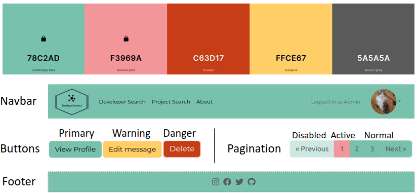

The [coolers colour scheme](https://coolors.co/78c2ad-f3969a-c63d17-ffce67-5a5a5a) shown above shows the basic colours used for the site.

<!-- ⚠️⚠️⚠️⚠️⚠️ START OF NOTES (to be deleted) ⚠️⚠️⚠️⚠️⚠️

If you've used CSS `:root` variables, consider also including a code snippet here!

🛑🛑🛑🛑🛑 END OF NOTES (to be deleted) 🛑🛑🛑🛑🛑

I've used CSS `:root` variables to easily update the global colour scheme by changing only one value, instead of everywhere in the CSS file.

```css
:root {
    /* P = Primary | S = Secondary */
    --p-text: #000000;
    --p-highlight: #E84610;
    --s-text: #4A4A4F;
    --s-highlight: #009FE3;
    --white: #FFFFFF;
    --black: #000000;
}
``` -->

### Typography

The fonts contained within the "minty" Bootswatch theme were used for this project.
Additional icons from the [Font Awesome](https://fontawesome.com) library were used. Icons were used throughout the site, including the social media icons in the footer and the edit/delete icons for messages. The icons used are shown below:

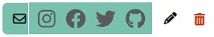

## User Stories

User stories are an integral part of software design and execution and help not only with the design on the features but also with the management of the project. User stories represent the small units of work which can be undertaken during an iteration (or "sprint"). 

In this project, User Stories are broken down from three "Epics". Epics are large overarching concepts which define the major parts of the software being developed. These epics were then dissected into smaller User Stories. The epics used for this project were:
1. Account Management  
2. User interaction  
3. Project interaction

Github actions was used to record epics and user stories and a [User Story template](https://github.com/dragon-fire-fly/developer_matcher/blob/main/.github/ISSUE_TEMPLATE/user-story.md) was created and used for the purpose of recording the user stories and for breaking them down into "acceptance criteria" - the conditions which must be met in order for the User Story to be considered "finished" - and "tasks" - the actual work that needs to be done in order to meet these acceptance criteria.

The User Stories are listed below and are linked to the respective issue on Github actions:


| Issue #  | Epic  | User Story  | Prioritisation  | Implemented   |
|---|---|---|---|---|
| 1  | Account Management  |  [As a **new site user** I can **create a new user account** so that **I can log into and use the full functionality of the site**](https://github.com/dragon-fire-fly/developer_connect/issues/1)  | Must-do  | Yes  |
| 2  | Account Management  | [As a **registered user** I can **log in to my user account** so that **I can access full functionality of the site**](https://github.com/dragon-fire-fly/developer_connect/issues/2)   |  Must-do | Yes  |
| 3  | Account Management  | [As a **registered user** I can **view, update and delete my profile** so that **I can amend and delete my data**](https://github.com/dragon-fire-fly/developer_connect/issues/3)  | Must-do  |  Yes |
| 5  |  User interaction   | [As a **registered user** I can **see an overview of other users on the site** so that **I can get an overview of the skills, interests and projects of other users**](https://github.com/dragon-fire-fly/developer_connect/issues/5)  | Must-do  | Yes  |
| 6  | User interaction  | [As a **registered user** I can **view the profiles of other users** so that **I can see whether this user is interesting to me based on my interests, programming languages, current projects, etc.**](https://github.com/dragon-fire-fly/developer_connect/issues/6)  | Must-do  | Yes  |
| 8  | Project interaction  | [As a **registered user** I can **see an overview of all the active projects posted on the site** so that **I can read details about the projects and decide which are potentially of interest to me**](https://github.com/dragon-fire-fly/developer_connect/issues/8)  | Must-do  | Yes  |
| 9  |  Project interaction | [As a **registered site user** I can **view the details of active projects** so that **I can assess if the project is of interest to me, if my skills and experience are suitable for the project and contact the project owner**](https://github.com/dragon-fire-fly/developer_connect/issues/9)  | Must-do  | Yes  |
| 39  | Project Interaction  | [As a **registered user** I can **create a new project** so that **I can advertise the project to other, potentially interested users**](https://github.com/dragon-fire-fly/developer_matcher/issues/39)  | Must-do  | Yes  |
| 40  | Project Interaction  | [As a **project owner** I can **edit and delete my own projects** so that **I can update the details or remove the project from the site**](https://github.com/dragon-fire-fly/developer_matcher/issues/40)  | Must-do  | Yes  |
| 42  | Project Interaction  | [As a **project owner** I can **add and remove images for my project** so that **other users can get a visual idea of the project**](https://github.com/dragon-fire-fly/developer_matcher/issues/42)  | Must-do  | Yes  |
| 4  | Account Management  |  [As a **google account holder** I can **log in with my Gmail account** so that **I do not have to manually enter my details or create a password when signing up to the site**](https://github.com/dragon-fire-fly/developer_connect/issues/4)  | Should-do  | Yes  |
| 59  |  User Interaction | [As a **logged in user** I can **see a maximum number of entries per page and navigate through pages** so that **the page loading time is not too long and I do not get overwhelmed with too many entries**](https://github.com/dragon-fire-fly/developer_matcher/issues/59) | Should-do  | Yes  |
| 68  | User Interaction  | [As the **sender of a message** I can **edit my message** so that **I can change its contents** and as both a **sender and receiver of a message** I can **delete a message** so that I can **remove it from my account**](https://github.com/dragon-fire-fly/developer_matcher/issues/68)  | Should-do  | Yes  |
| 10  |  User interaction | [As a **registered site user** I can **like and message other users** so that **I can interact with other users and discuss interests or projects**](https://github.com/dragon-fire-fly/developer_connect/issues/10)  | Could-do  | Partially  |
| 7  | User interaction    | [As a **registered site user** I can **perform a search for other users based on a variety of parameters** so that **I can more easily find the type of user I am looking for**](https://github.com/dragon-fire-fly/developer_connect/issues/7)  | Could-do  | Partially  |
| 12  | Project interaction  | [As a **registered site user** I can **perform a search for projects based on a variety of parameters** so that **I can more easily find the type of project I am looking for**](https://github.com/dragon-fire-fly/developer_connect/issues/12)  | Could-do  | Partially  |
| 11  | Project interaction  | [As a **registered site user** I can **star and add comments to projects** so that **I can interact with projects, share my ideas and contact the project owner**](https://github.com/dragon-fire-fly/developer_connect/issues/11)  | Could-do  | No  |


## Wireframes

To follow best practice and to help with planning, wireframes were developed for mobile, tablet, and desktop sizes.
[Balsamiq](https://balsamiq.com/wireframes) was used to design the site wireframes. The table below shows the wireframes in all three sizes (mobile, tablet and desktop).

### Home Page Wireframes

| Page | Wireframes (mobile, tablet, desktop) |
| --- | --- |
| Log in page |  |
| Registration page |  |
| Individual Profile page |  |
| About page |  |
| Find Developer Page |  |
| Find Projects page |  |

## Features

⚠️⚠️⚠️⚠️⚠️ START OF NOTES (to be deleted) ⚠️⚠️⚠️⚠️⚠️

In this section, you should go over the different parts of your project,
and describe each in a sentence or so.

You will need to explain what value each of the features provides for the user,
focusing on who this website is for, what it is that they want to achieve,
and how your project is the best way to help them achieve these things.

For some/all of your features, you may choose to reference the specific project files that implement them.

IMPORTANT: Remember to always include a screenshot of each individual feature!

🛑🛑🛑🛑🛑 END OF NOTES (to be deleted) 🛑🛑🛑🛑🛑

### Existing Features

- **Navbar**

    - The navbar makes navigation around the site easy and intuitive for the user. On the left hand side, the 'Developer Connect' logo is displayed and links back to the home page. The other three links bring the user to the Developer Overview, Project Overview and About pages. On the right hand side, if the user is not yet logged in, they are invited to do so with 'sign in' and 'sign up' links and a message saying "Get connected now!".
    If the user is already registered and logged in, 
Navbar (user not logged in)
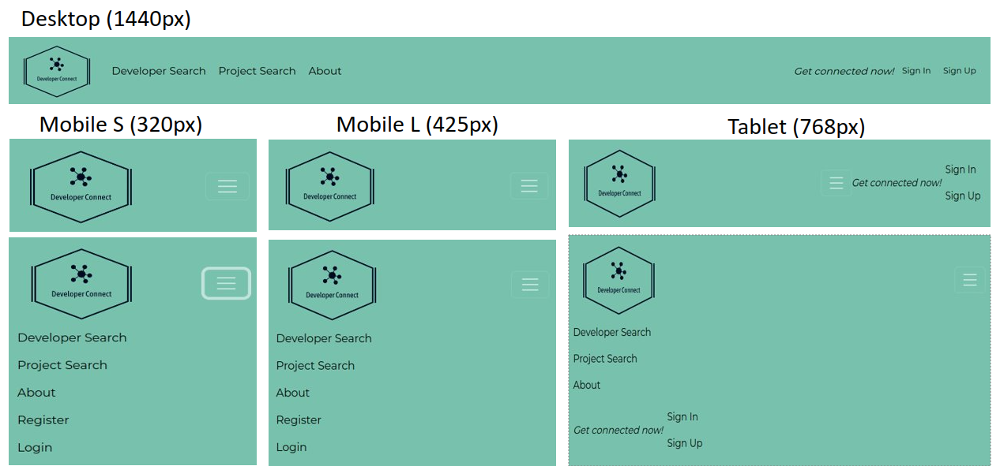
Navbar(user logged in)
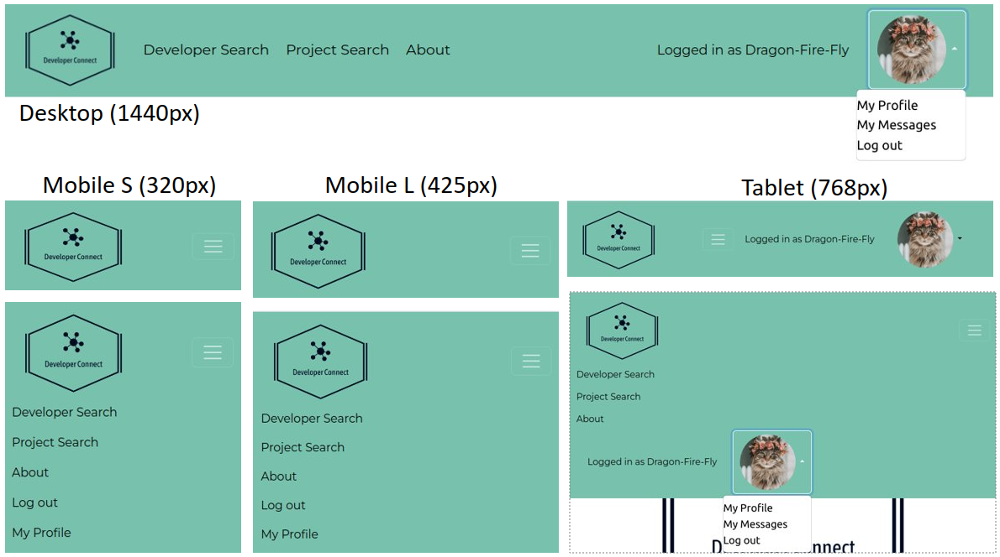

- **Homepage**

    - The homepage displays the "Developer Connect" logo and either "sign in" and "sign up" buttons, if no user is logged in, or hello ((username)) if a user is logged in

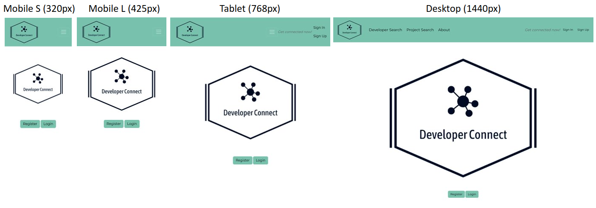

- **Registration page**

    - The registration page allows new users to register to the site. A form is provided which asks for desired username, e-mail address and a password, repeated twice. The constraints for password choice are displayed on the registration page. Users are informed if their chosen username is unavailable or unacceptable (see validation below).

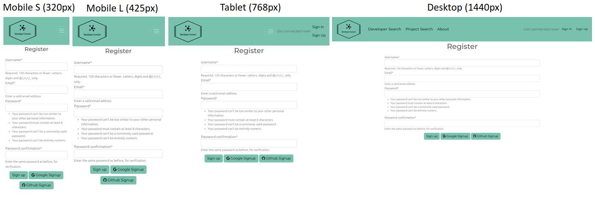

- **Login page**

    - The login page allows users who have registered on the site previously to log in with their credentials. There is also the option for a google or github log in.

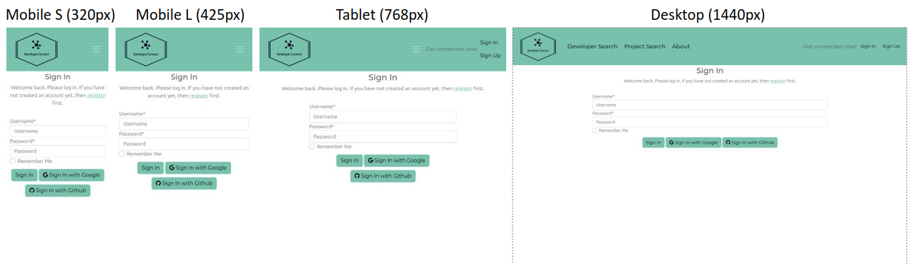


- **Developer Overview Page**

    - The Developer Overview page displays all the users registered on the site, excluding the currently logged in user. 8 users are displayed per page (see pagination below for more details)


- **Project Overview Page**

    - The Project Overview page displays all the projects made by users on the site (including any created by the logged in user). 4 projects are displayed per page (see pagination below for more details)

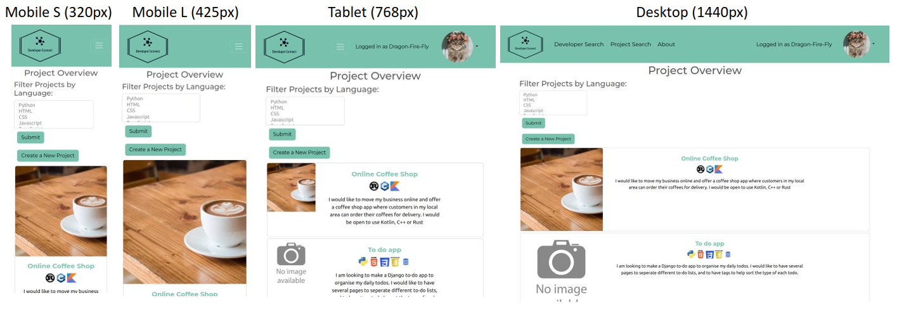

- **User Profile Page (logged in user)**

    - The User Profile page shows the profile for the currently logged in user and may be accessed through the dropdown menu on the right hand side of the nav bar (under the user's picture). The profile page shows all detaila of the user, including their e-mail address. 
    The user's primary profile picture is displayed in the centre of the screen and when clicked, navigates the user to the "add profile picture" page. If the user does not yet have a profile picture, a placeholder picture will be displayed, with text explaining that this is a placeholder piture and may be changed by clicking the photo and uploading a picture.
    This placeholder picture is a randomly generated photo of a kitten, from [Place Kitten](https://placekitten.com/).

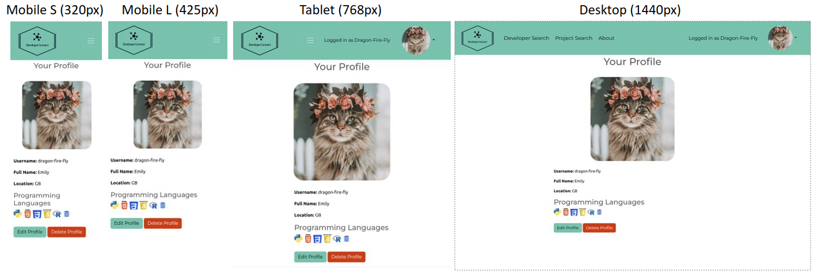
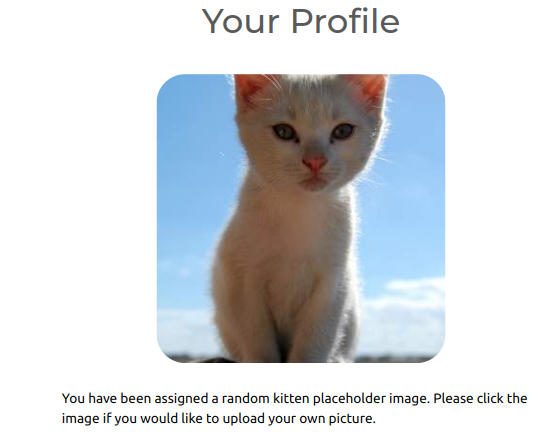

- **Edit User Profile Page(logged in user)**

    - Details about this particular feature, including the value to the site, and benefit for the user. Be as detailed as possible!

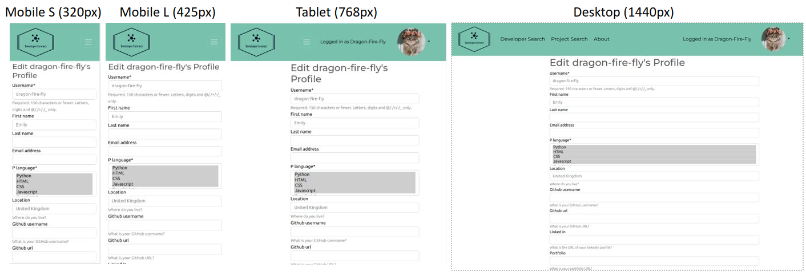

- **Delete User Account**

    - TODO: ADD !!!


- **Profile Picture Overview**

    - When the user clicks on the picture on their User account (see 3 features up), they are taken the the profile picture overview page. From here they may upload new profile pictures or delete existing ones. The first uploaded picture becomes the profile picture displayed on their public profile and the thumbnail picture in the nav bar. Pictures are uploaded to [Cloudinary](https://cloudinary.com/) where they are stored and retreived and upon deletion, they are also deleted from Cloudinary.

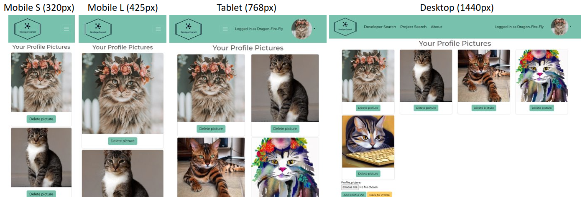


- **Profile Picture CRUD**

    - User profile pictures have partial "CRUD" functionality. A user can create (upload) a new image, read (view) an uploaded picture and delete a picture. The create-view-delete cycle is shown below. When deleting a profile picture, the user is prompted to confirm that they really want to delete the chosen picture with a pop-up modal to prevent accidental deletion. Messages are shown when upload and deletion functions successfully complete.

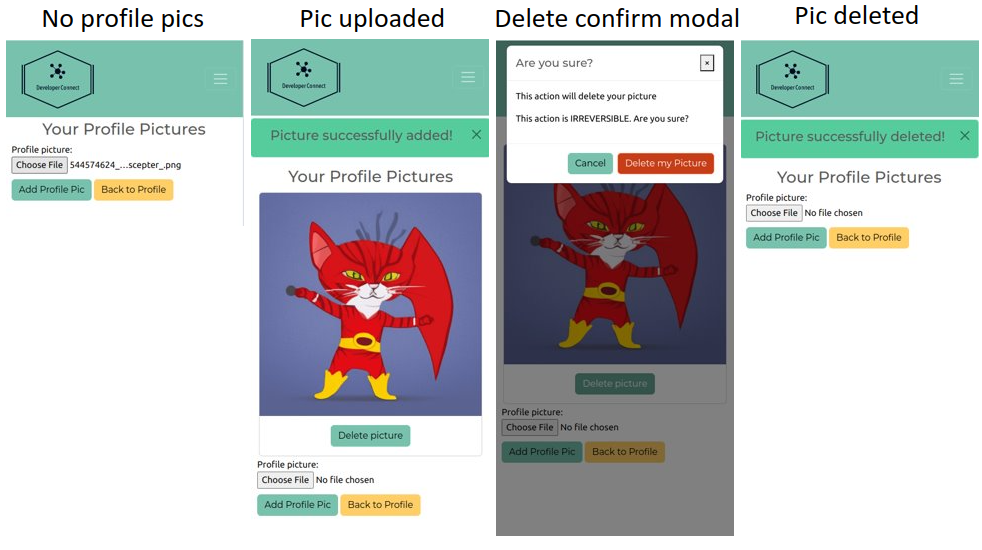


- **Project CRUD**

    - Projects have full "CRUD" functionality. A user can create (upload) a new project, read (view) an existing project, edit their own projects and delete their own projects. The create-view-edit-delete cycle is shown below.
    In the create phase, the user completes a project creation form stating the title and programming languages required for the project. They may also optionally include a project description. If successfully created, the user receives a success message and is redirected to the detail page for the newly created project.
    As shown in the "project read" section, the project now appears on the project overview page for all logged in users, has an individual project page with the details and is listed under "projects" for the user that created it.
    The project may be updated only by the user that created it (or an admin in the admin panel) and all of the fields may be edited.
    The project may be deleted at any time by the user that created it (or an admin in the admin panel). Before deletion, the user receives a pop-up modal to confirm they want to delete their project. If "Delete my project" is selected, the user receives a "project successfully deleted message at the top of the screen. When a project is deleted, all associated pictures are also deleted (including from Cloudinary).
    If a user is deleted, the project remains on the project page but no longer has a user associated with it.

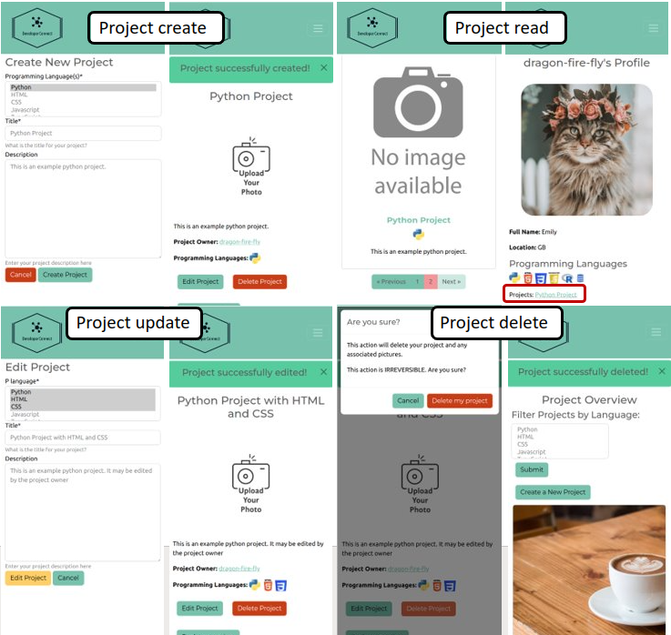

- The buttons available vary depending on who owns the project. If the logged in user is the project owner, they can edit and delete the project, as well as adding or changing the photo (by clicking on it). If the logged in user does not own the project, they will have the option to message the project owner directly, or to visit the project owner's profile by clicking their name. They cannot edit or delete the project.

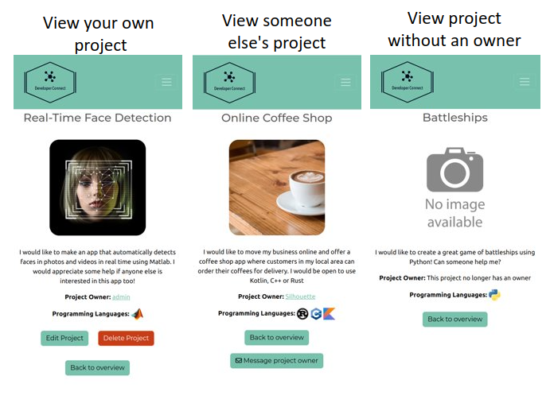

- **Create New Project**

    - The create new project form is shown here on multiple screen sizes to demonstrate the responsiveness of the project creation form. Users can select at least one programming language (relabeled from "P language" to "Programming language(s)" since these screenshots were taken)

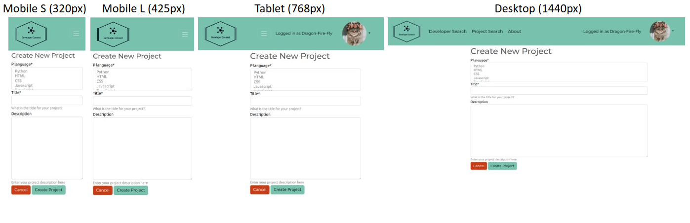

- **Project Picture CRUD**

    - Project pictures have partial "CRUD" functionality. A user can create (upload) a new image, read (view) an uploaded picture and delete a picture. The create-view-delete cycle is shown below. When deleting a project picture, the user is prompted to confirm that they really want to delete the chosen picture with a pop-up modal to prevent accidental deletion. Messages are shown when upload and deletion functions successfully complete.

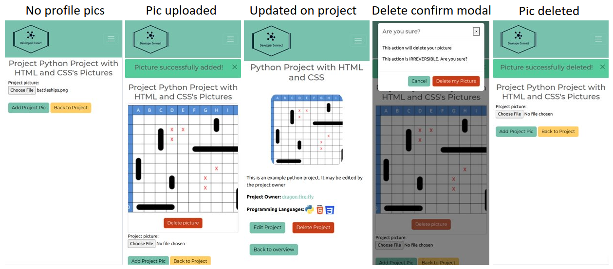

- **Messages Inbox and Sent Messages**

    - Each registered user has a messages inbox and a sent messages mail box. These can be accessed by hovering over the user's profile picture in the navigation bar and selecting "My messages". This brings the user to the received messages "inbox" page. To access the "outbox", the user clicks the "Sent messages" button at the top. Inversely, to get back to the inbox from the sent messages page, the user clicks the "Received messages" button, or accesses again through the navigation bar.

    The layout of the message lists varies depending on the screen size of the device used. For smaller devices, only the key information is displayed - username of the sender/recevier, title of the message and the sent/received date and time. If users use a device with a screen width of 768px or above, they can also see a thumbnail of the sender/receiver's profile picture and they have the option to delete (and edit, if the sender) from this list view. If using a screen size of below 768px, users must go into the individual message if they wish to edit or delete the message.
    Users of all screen sizes may access the user profile of the sender/receiver by clicking their username and may access the individual message by clicking the message title.

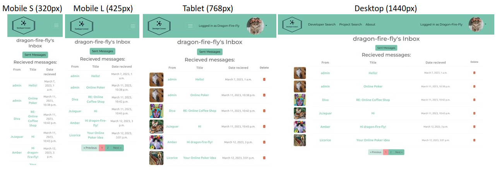
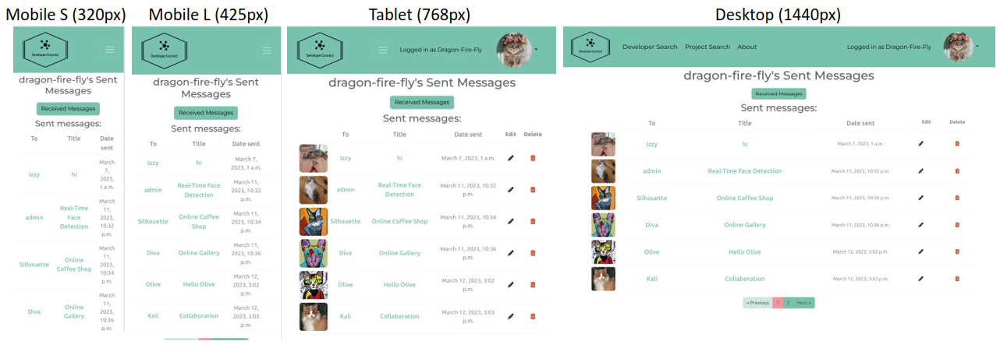

- **Messages CRUD**

    - The messaging feature has full "CRUD" functionality. Users can create new messages, view both sent and received messages, edit messages they sent and delete messages they sent or received. 
    Once edited, the message displays a small "edited" text at the end of the message. Only the sender may edit a particular message, but either party may delete a message. In this case, the message is deleted from the database and is no longer visible to either the sender or the receiver.


- **Send new message**

    - The send new message form is fully responsive and shows the profile picture of the message receiver as well as their username. 

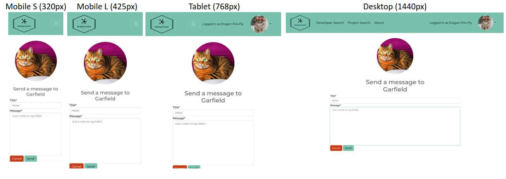
- The new message form can be accessed from three locations. 
    1. The user profile of the selected user
    2. The project page - the project owner can be messaged directly from here
    3. If a message has been received from another user, this user may be messaged back by clicking "Reply".

    Pressing cancel will take the user to the message inbox, regardless of which page the user came from.
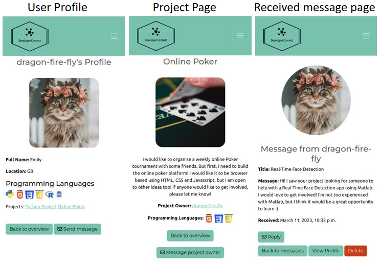

- **Edit message**

    - Once a message has been sent, it may be edited by the user who sent it. Only the sender may edit the message. Once edited, a small "edited" will appear at the end of the message to indicate that changes were made from the original message. Pressing cancel will take the user back to the message. Pressing edit message will take the user back to their inbox and will display a "Message successfully updated" message.
    If using a screen size of 768px or above, users may edit messages directly from the sent messages list. Otherwise, users from all screen sizes may edit messages from the individual message page.

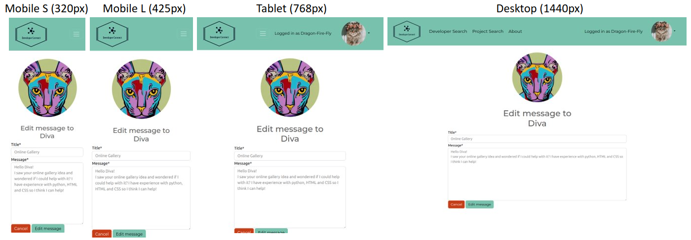

- **Delete message**

    - Messages may be deleted by either the sender or the receiver. If one party deletes the message, it will be deleted from the database and will therefore no longer be accessible for either party. Before deletion occurs, the user is prompted with a pop-up modal to confirm if they really want to delete the message. It also warns that the message will be deleted for both the sender and the receiver.
    If using a screen size of 768px or above, users may delete messages directly from the inbox or sent messages list. Otherwise, users from all screen sizes may delete messages from the individual message page.

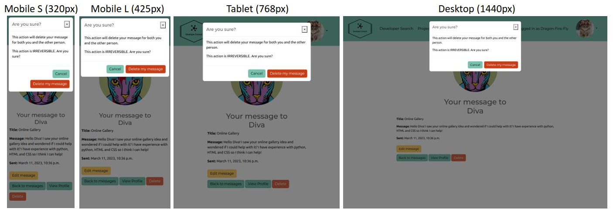

- **Individual messages**

    - From the inbox/ sent messages page, individual messages may be accessed by clicking on the title. The contents of this individual page varies slightly depending on whether it is a sent or received message. In both cases, an image of the user is displayed at the top with eiter the text "Your message to ((username))" or "Message from ((username))". Both message types then display the title and message with the option to go back to messages, view the user's profile or delete the message. If it is a sent message, the option to "Edit message" is present. If it is a received message, the option to "Reply" is present.

Individual sent message page
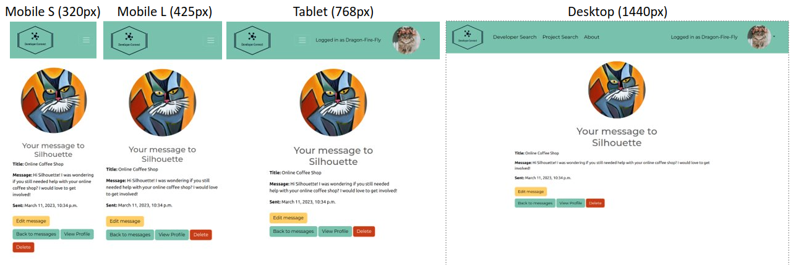
Individual received message page
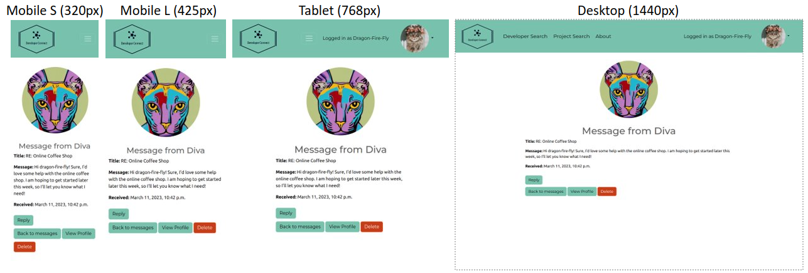

- **Django Messages**

    - The Django messages feature is utilised in this project to provide feedback to the user. The messages are displayed at the top of the screen for all screen sizes, just under the navigation bar. The messages are styled with bootstrap.
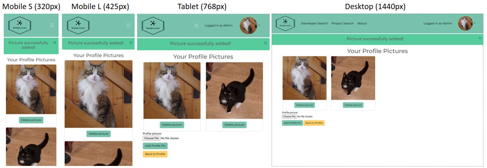
The following image shows screenshots of the messages in action. All CRUD functions give user feedback via these messages.
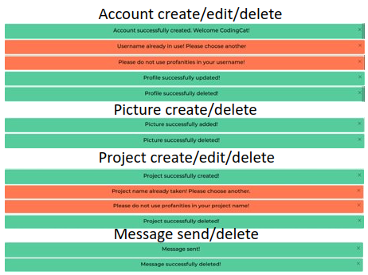

- **Filtering**

    - Details about this particular feature, including the value to the site, and benefit for the user. Be as detailed as possible!

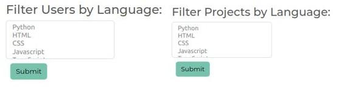

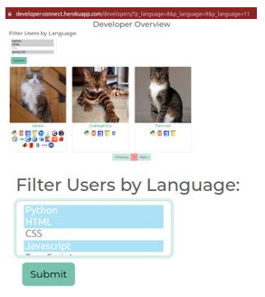

- **Pagination**

    - Django's Paginator class is utilised to provide pagination for the Developer Overview, Project Overview and messages pages. Both of these pages have a navigation panel at the bottom of the screen showing how many pages are available, the current page (highlighed in pink) and previous and next buttons. Users can nagivate using the previous and next buttons as long as a previous or next page is available (for example, the "previous" button will not work if the user is on page 1). If one or both of these buttons are unavailable, they will be greyed out as shown below and be will become non-clickable.

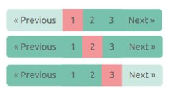

Pagination works alone but can also be combined with the filtering mentioned above. The site is set up to recieve arguments in the url for filtering, pagination, or both. The screenshot below demonstrates some of the different combinations possible.
The base url for the developer page is `https://developer-connect.herokuapp.com/developers/` and queries can be made using `.../developers/?` followed by the query. This can be either `p_language=(num)` or `page=(num)`.

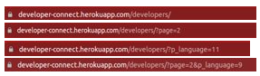


### Future Features

There are many features which could be added to the project at a later date but were not deemed important for this iteration of the project implementation. Some ideas for future features include:

- A notification system for messages
    - This would allow users to see when they have recevied a new message instead of having to manually check their inbox. This would be extremely helpful for the overall user experience of the site and is the highest priority future feature.

- The ability to add other users to the project 
    - This would mean that all the users associated with a particular project would be listed under the project and not just the project owner. This would help with networking and getting involved in projects more easily.

- The ability to favourite users and projects to be able to quickly find them again in the future
    - Having a "Favourites" page for projects and users would streamline the site, particularly if there became a large number of users on the site. If there are 100+ users, for example, it may be difficult to find a particular user just by browsing through pages or past messages.

- Search and sort functionality for Developer and Project Overview pages and messages
    - Similar to the "favourites" page above, having search and sort functionality would help with finding specific users or re-finding a user you were interested in before. This would be an extension of the "filtering" feature currently implemented in the project.

- Addition of other skills users could select in addition to programming languages - such as frameworks, dadabases and stacks.
    - This would help find specific users or projects more easily if, for example, a project requires Django expertise with postgreSQL, or any other combination of frameworks, databases, etc.

- A password reset function
    - This would help returning users if they have forgotten their password or wish to reset it for any reason (e.g. a data breach on another site)

- Email notification system for sign up, unauthorised accessed, password reset, new message etc.
    - This would help improve the user experience by providing extra security and adding a professional touch. It could also improve engagement with the site, for example receiving an email when they receive a message or having a reminder email after a period of inactivity.

- An administrator area where administrators can have an overview of users, projects etc. and make amendments without needing to go into the admin panel
    - This could streamline the administration of the site and improve the user experience for administrator users.

## Tools & Technologies Used

⚠️⚠️⚠️⚠️⚠️ START OF NOTES (to be deleted) ⚠️⚠️⚠️⚠️⚠️

In this section, you should explain the various tools and technologies used to develop the project.
Make sure to put a link (where applicable) to the source, and explain what each was used for.
Some examples have been provided, but this is just a sample only, your project might've used others.
Feel free to delete any unused items below as necessary.

🛑🛑🛑🛑🛑 END OF NOTES (to be deleted) 🛑🛑🛑🛑🛑

- [HTML](https://en.wikipedia.org/wiki/HTML) used for the main site content.
- [CSS](https://en.wikipedia.org/wiki/CSS) used for the main site design and layout.
<!-- - [CSS :root variables](https://www.w3schools.com/css/css3_variables.asp) used for reusable styles throughout the site. -->
- [CSS Flexbox](https://www.w3schools.com/css/css3_flexbox.asp)
- [Bootstrap](https://getbootstrap.com) used as the front-end CSS framework for modern responsiveness and pre-built components.
- [Bootswatch](https://bootswatch.com/) used as an extension to Bootstrap to provide pleasant aesthetics for the site.
<!-- - [JavaScript](https://www.javascript.com) used for user interaction on the site. -->
- [Python](https://www.python.org) used as the back-end programming language.
- [Git](https://git-scm.com) used for version control. (`git add`, `git commit`, `git push`)
- [GitHub](https://github.com) used for secure online code storage.
- [Gitpod](https://gitpod.io) used as a cloud-based IDE for development.
- [Markdown Builder by Tim Nelson](https://traveltimn.github.io/markdown-builder) used to help generate the Markdown files.
- [Django](https://www.djangoproject.com) used as the Python framework for the site.
- [PostgreSQL](https://www.postgresql.org) used as the relational database management.
- [ElephantSQL](https://www.elephantsql.com) used as the Postgres database.
- [Heroku](https://www.heroku.com) used for hosting the deployed back-end site.
- [Cloudinary](https://cloudinary.com) used for online static file storage.
- [Visual Studio Code](https://code.visualstudio.com/) used as a local IDE for development.
- [Black](https://pypi.org/project/black/) used as a PEP8 compliant Python code formatter
- [DBeaver](https://dbeaver.io/) used to produce ERDs and helpplan the database models
- [Balsamiq](https://balsamiq.com/) used to produce wireframes

## Database Design


Entity Relationship Diagrams (ERD) help to visualize database architecture before creating models.
Understanding the relationships between different tables can save time later in the project.

⚠️⚠️⚠️⚠️⚠️ START OF NOTES (to be deleted) ⚠️⚠️⚠️⚠️⚠️

Using your defined models (one example below), create an ERD with the relationships identified.

🛑🛑🛑🛑🛑 END OF NOTES (to be deleted) 🛑🛑🛑🛑🛑

```python
class Product(models.Model):
    category = models.ForeignKey(
        "Category", null=True, blank=True, on_delete=models.SET_NULL)
    sku = models.CharField(max_length=254, null=True, blank=True)
    name = models.CharField(max_length=254)
    description = models.TextField()
    has_sizes = models.BooleanField(default=False, null=True, blank=True)
    price = models.DecimalField(max_digits=6, decimal_places=2)
    rating = models.DecimalField(
        max_digits=6, decimal_places=2, null=True, blank=True)
    image_url = models.URLField(max_length=1024, null=True, blank=True)
    image = models.ImageField(null=True, blank=True)

    def __str__(self):
        return self.name
```

⚠️⚠️⚠️⚠️⚠️ START OF NOTES (to be deleted) ⚠️⚠️⚠️⚠️⚠️

A couple recommendations for building free ERDs:
- [Draw.io](https://draw.io)
- [Lucidchart](https://www.lucidchart.com/pages/ER-diagram-symbols-and-meaning)

🛑🛑🛑🛑🛑 END OF NOTES (to be deleted) 🛑🛑🛑🛑🛑


⚠️⚠️⚠️⚠️⚠️ START OF NOTES (to be deleted) ⚠️⚠️⚠️⚠️⚠️

Using Markdown formatting to represent an example ERD table using the Product model above:

🛑🛑🛑🛑🛑 END OF NOTES (to be deleted) 🛑🛑🛑🛑🛑

- Table: **Product**

    | **PK** | **id** (unique) | Type | Notes |
    | --- | --- | --- | --- |
    | **FK** | category | ForeignKey | FK to **Category** model |
    | | sku | CharField | |
    | | name | CharField | |
    | | description | TextField | |
    | | has_sizes | BooleanField | |
    | | price | DecimalField | |
    | | rating | DecimalField | |
    | | image_url | URLField | |
    | | image | ImageField | |

## Agile Development Process

### GitHub Projects

[GitHub Projects](https://github.com/dragon-fire-fly/developer_matcher/projects) served as an Agile tool for this project.
It isn't a specialized tool, but with the right tags and project creation/issue assignments, it can be made to work.

Through it, user stories, issues, and milestone tasks were planned, then tracked on a weekly basis using the basic Kanban board.

⚠️⚠️⚠️⚠️⚠️ START OF NOTES (to be deleted) ⚠️⚠️⚠️⚠️⚠️

Consider adding a basic screenshot of your Projects Board.

🛑🛑🛑🛑🛑 END OF NOTES (to be deleted) 🛑🛑🛑🛑🛑


### GitHub Issues

[GitHub Issues](https://github.com/dragon-fire-fly/developer_matcher/issues) served as an another Agile tool.
There, I used my own **User Story Template** to manage user stories.

It also helped with milestone iterations on a weekly basis.

⚠️⚠️⚠️⚠️⚠️ START OF NOTES (to be deleted) ⚠️⚠️⚠️⚠️⚠️

Consider adding a screenshot of your Open and Closed Issues.

🛑🛑🛑🛑🛑 END OF NOTES (to be deleted) 🛑🛑🛑🛑🛑

- [Open Issues](https://github.com/dragon-fire-fly/developer_matcher/issues)

    

- [Closed Issues](https://github.com/dragon-fire-fly/developer_matcher/issues?q=is%3Aissue+is%3Aclosed)

    

### MoSCoW Prioritization

I've decomposed my Epics into stories prior to prioritizing and implementing them.
Using this approach, I was able to apply the MoSCow prioritization and labels to my user stories within the Issues tab.

- **Must Have**: guaranteed to be delivered (*max 60% of stories*)
- **Should Have**: adds significant value, but not vital (*the rest ~20% of stories*)
- **Could Have**: has small impact if left out (*20% of stories*)
- **Won't Have**: not a priority for this iteration

## Testing

For all testing, please refer to the [TESTING.md](TESTING.md) file.

## Deployment

⚠️⚠️⚠️⚠️⚠️ START OF NOTES (to be deleted) ⚠️⚠️⚠️⚠️⚠️

**IMPORTANT:**
- ⚠️ DO NOT update the environment variables to your own! These should NOT be included in this file; just demo values! ⚠️
- ⚠️ DO NOT update the environment variables to your own! These should NOT be included in this file; just demo values! ⚠️
- ⚠️ DO NOT update the environment variables to your own! These should NOT be included in this file; just demo values! ⚠️

🛑🛑🛑🛑🛑 END OF NOTES (to be deleted) 🛑🛑🛑🛑🛑

The live deployed application can be found deployed on [Heroku](https://developer-connect.herokuapp.com).

### ElephantSQL Database

This project uses [ElephantSQL](https://www.elephantsql.com) for the PostgreSQL Database.

To obtain your own Postgres Database, sign-up with your GitHub account, then follow these steps:
- Click **Create New Instance** to start a new database.
- Provide a name (this is commonly the name of the project: developer_matcher).
- Select the **Tiny Turtle (Free)** plan.
- You can leave the **Tags** blank.
- Select the **Region** and **Data Center** closest to you.
- Once created, click on the new database name, where you can view the database URL and Password.

### Cloudinary API

This project uses the [Cloudinary API](https://cloudinary.com) to store media assets online, due to the fact that Heroku doesn't persist this type of data.

To obtain your own Cloudinary API key, create an account and log in.
- For *Primary interest*, you can choose *Programmable Media for image and video API*.
- Optional: *edit your assigned cloud name to something more memorable*.
- On your Cloudinary Dashboard, you can copy your **API Environment Variable**.
- Be sure to remove the `CLOUDINARY_URL=` as part of the API **value**; this is the **key**.

### Heroku Deployment

This project uses [Heroku](https://www.heroku.com), a platform as a service (PaaS) that enables developers to build, run, and operate applications entirely in the cloud.

Deployment steps are as follows, after account setup:

- Select **New** in the top-right corner of your Heroku Dashboard, and select **Create new app** from the dropdown menu.
- Your app name must be unique, and then choose a region closest to you (EU or USA), and finally, select **Create App**.
- From the new app **Settings**, click **Reveal Config Vars**, and set your environment variables.

| Key | Value |
| --- | --- |
| `CLOUDINARY_URL` | user's own value |
| `DATABASE_URL` | user's own value |
| `DISABLE_COLLECTSTATIC` | 1 (*this is temporary, and can be removed for the final deployment*) |
| `SECRET_KEY` | user's own value |

Heroku needs two additional files in order to deploy properly.
- requirements.txt
- Procfile

You can install this project's **requirements** (where applicable) using:
- `pip3 install -r requirements.txt`

If you have your own packages that have been installed, then the requirements file needs updated using:
- `pip3 freeze --local > requirements.txt`

The **Procfile** can be created with the following command:
- `echo web: gunicorn app_name.wsgi > Procfile`
- *replace **app_name** with the name of your primary Django app name; the folder where settings.py is located*

For Heroku deployment, follow these steps to connect your own GitHub repository to the newly created app:

Either:
- Select **Automatic Deployment** from the Heroku app.

Or:
- In the Terminal/CLI, connect to Heroku using this command: `heroku login -i`
- Set the remote for Heroku: `heroku git:remote -a app_name` (replace *app_name* with your app name)
- After performing the standard Git `add`, `commit`, and `push` to GitHub, you can now type:
	- `git push heroku main`

The project should now be connected and deployed to Heroku!

### Local Deployment

This project can be cloned or forked in order to make a local copy on your own system.

For either method, you will need to install any applicable packages found within the *requirements.txt* file.
- `pip3 install -r requirements.txt`.

You will need to create a new file called `env.py` at the root-level,
and include the same environment variables listed above from the Heroku deployment steps.

Sample `env.py` file:

```python
import os

os.environ.setdefault("CLOUDINARY_URL", "user's own value")
os.environ.setdefault("DATABASE_URL", "user's own value")
os.environ.setdefault("SECRET_KEY", "user's own value")

# local environment only (do not include these in production/deployment!)
os.environ.setdefault("DEBUG", "True")
```

Once the project is cloned or forked, in order to run it locally, you'll need to follow these steps:
- Start the Django app: `python3 manage.py runserver`
- Stop the app once it's loaded: `CTRL+C` or `⌘+C` (Mac)
- Make any necessary migrations: `python3 manage.py makemigrations`
- Migrate the data to the database: `python3 manage.py migrate`
- Create a superuser: `python3 manage.py createsuperuser`
- Load fixtures (if applicable): `python3 manage.py loaddata file-name.json` (repeat for each file)
- Everything should be ready now, so run the Django app again: `python3 manage.py runserver`

#### Cloning

You can clone the repository by following these steps:

1. Go to the [GitHub repository](https://github.com/dragon-fire-fly/developer_matcher) 
2. Locate the Code button above the list of files and click it 
3. Select if you prefer to clone using HTTPS, SSH, or GitHub CLI and click the copy button to copy the URL to your clipboard
4. Open Git Bash or Terminal
5. Change the current working directory to the one where you want the cloned directory
6. In your IDE Terminal, type the following command to clone my repository:
	- `git clone https://github.com/dragon-fire-fly/developer_matcher.git`
7. Press Enter to create your local clone.

Alternatively, if using Gitpod, you can click below to create your own workspace using this repository.

[](https://gitpod.io/#https://github.com/dragon-fire-fly/developer_matcher)

Please note that in order to directly open the project in Gitpod, you need to have the browser extension installed.
A tutorial on how to do that can be found [here](https://www.gitpod.io/docs/configure/user-settings/browser-extension).

#### Forking

By forking the GitHub Repository, we make a copy of the original repository on our GitHub account to view and/or make changes without affecting the original owner's repository.
You can fork this repository by using the following steps:

1. Log in to GitHub and locate the [GitHub Repository](https://github.com/dragon-fire-fly/developer_matcher)
2. At the top of the Repository (not top of page) just above the "Settings" Button on the menu, locate the "Fork" Button.
3. Once clicked, you should now have a copy of the original repository in your own GitHub account!

### Local VS Deployment

⚠️⚠️⚠️⚠️⚠️ START OF NOTES (to be deleted) ⚠️⚠️⚠️⚠️⚠️

Use this space to discuss any differences between the local version you've developed, and the live deployment site on Heroku.

🛑🛑🛑🛑🛑 END OF NOTES (to be deleted) 🛑🛑🛑🛑🛑

## Credits

⚠️⚠️⚠️⚠️⚠️ START OF NOTES (to be deleted) ⚠️⚠️⚠️⚠️⚠️

In this section you need to reference where you got your content, media, and extra help from.
It is common practice to use code from other repositories and tutorials,
however, it is important to be very specific about these sources to avoid plagiarism.

🛑🛑🛑🛑🛑 END OF NOTES (to be deleted) 🛑🛑🛑🛑🛑

### Content

⚠️⚠️⚠️⚠️⚠️ START OF NOTES (to be deleted) ⚠️⚠️⚠️⚠️⚠️

Use this space to provide attribution links to any borrowed code snippets, elements, or resources.
A few examples have been provided below to give you some ideas.

Ideally, you should provide an actual link to every resource used, not just a generic link to the main site!

🛑🛑🛑🛑🛑 END OF NOTES (to be deleted) 🛑🛑🛑🛑🛑

| Source | Location | Notes |
| --- | --- | --- |
| [Markdown Builder by Tim Nelson](https://traveltimn.github.io/markdown-builder) | README and TESTING | tool to help generate the Markdown files |
| [Chris Beams](https://chris.beams.io/posts/git-commit) | version control | "How to Write a Git Commit Message" |
| [W3Schools](https://www.w3schools.com/howto/howto_js_topnav_responsive.asp) | entire site | responsive HTML/CSS/JS navbar |
| [W3Schools](https://www.w3schools.com/howto/howto_css_modals.asp) | contact page | interactive pop-up (modal) |
| [W3Schools](https://www.w3schools.com/css/css3_variables.asp) | entire site | how to use CSS :root variables |
| [Flexbox Froggy](https://flexboxfroggy.com/) | entire site | modern responsive layouts |
| [Grid Garden](https://cssgridgarden.com) | entire site | modern responsive layouts |
| [StackOverflow](https://stackoverflow.com/a/2450976) | quiz page | Fisher-Yates/Knuth shuffle in JS |
| [YouTube](https://www.youtube.com/watch?v=YL1F4dCUlLc) | leaderboard | using `localStorage()` in JS for high scores |
| [YouTube](https://www.youtube.com/watch?v=u51Zjlnui4Y) | PP3 terminal | tutorial for adding color to the Python terminal |
| [strftime](https://strftime.org) | CRUD functionality | helpful tool to format date/time from string |
| [WhiteNoise](http://whitenoise.evans.io) | entire site | hosting static files on Heroku temporarily |

### Media

⚠️⚠️⚠️⚠️⚠️ START OF NOTES (to be deleted) ⚠️⚠️⚠️⚠️⚠️

Use this space to provide attribution links to any images, videos, or audio files borrowed from online.
A few examples have been provided below to give you some ideas.

If you're the owner (or a close acquaintance) of all media files, then make sure to specify this.
Let the assessors know that you have explicit rights to use the media files within your project.

Ideally, you should provide an actual link to every media file used, not just a generic link to the main site!
The list below is by no means exhaustive. Within the Code Institute Slack community, you can find more "free media" links
by sending yourself the following command: `!freemedia`.

🛑🛑🛑🛑🛑 END OF NOTES (to be deleted) 🛑🛑🛑🛑🛑

| Source | Location | Type | Notes |
| --- | --- | --- | --- |
| [Pexels](https://www.pexels.com) | entire site | image | favicon on all pages |
| [Lorem Picsum](https://picsum.photos) | home page | image | hero image background |
| [Unsplash](https://unsplash.com) | product page | image | sample of fake products |
| [Pixabay](https://pixabay.com) | gallery page | image | group of photos for gallery |
| [Wallhere](https://wallhere.com) | footer | image | background wallpaper image in the footer |
| [This Person Does Not Exist](https://thispersondoesnotexist.com) | testimonials | image | headshots of fake testimonial images |
| [Audio Micro](https://www.audiomicro.com/free-sound-effects) | game page | audio | free audio files to generate the game sounds |
| [Videvo](https://www.videvo.net/) | home page | video | background video on the hero section |
| [TinyPNG](https://tinypng.com) | entire site | image | tool for image compression |

### Acknowledgements

⚠️⚠️⚠️⚠️⚠️ START OF NOTES (to be deleted) ⚠️⚠️⚠️⚠️⚠️

Use this space to provide attribution to any supports that helped, encouraged, or supported you throughout the development stages of this project.
A few examples have been provided below to give you some ideas.

🛑🛑🛑🛑🛑 END OF NOTES (to be deleted) 🛑🛑🛑🛑🛑

- I would like to thank my Code Institute mentor, [John/Jane Doe](https://github.com/username) for their support throughout the development of this project.
- I would like to thank the [Code Institute](https://codeinstitute.net) tutor team for their assistance with troubleshooting and debugging some project issues.
- I would like to thank the [Code Institute Slack community](https://code-institute-room.slack.com) for the moral support; it kept me going during periods of self doubt and imposter syndrome.
- I would like to thank my spouse/partner (John/Jane), for believing in me, and allowing me to make this transition into software development.
- I would like to thank my employer, for supporting me in my career development change towards becoming a software developer.
