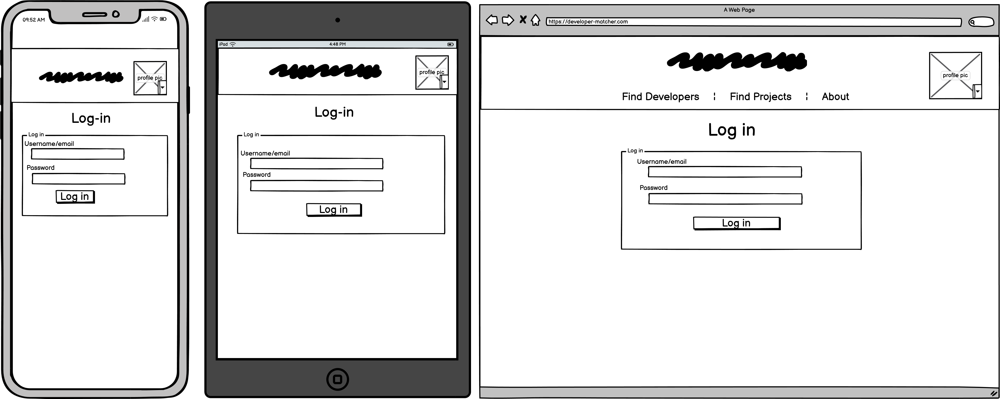
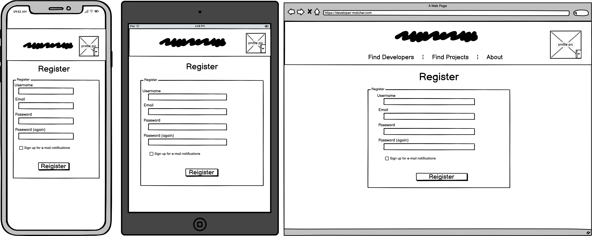
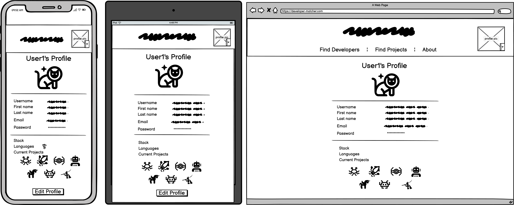
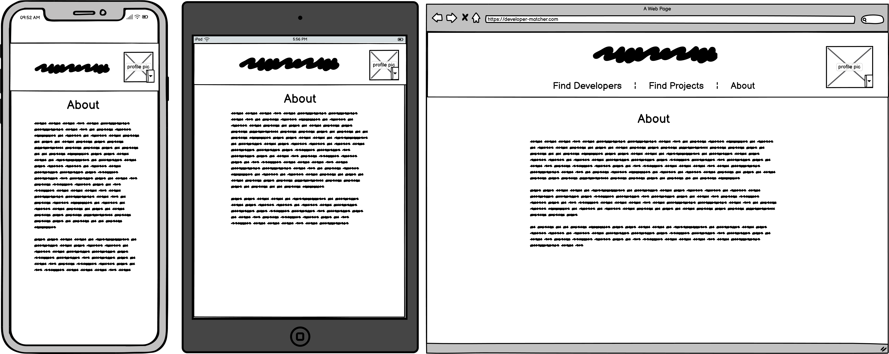
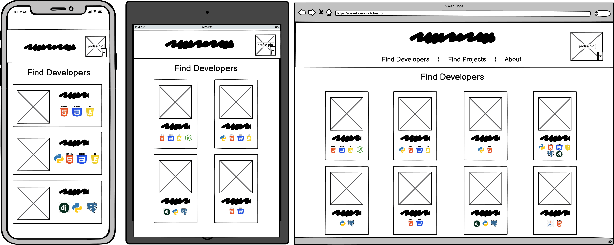
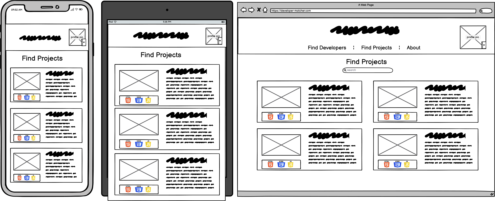

# Developer Connect

## Repository
<!-- Link to repo here once live -->

## Objective
The objective of Developer Connect is to link software developers up with eachother so that they can form teams and work on projects. Furthermore, a project posting board allows the opportunity for people with app, website or software ideas to build a team with the appropriate skills and technological experience to bring their idea(s) to life. The platform also provides a way for developers to connect with one another and for potential employers to find their next ideal candidate.

## User Experience
### User Stories
1. [As a **new site user** I can **create a new user account** so that **I can log into and use the full functionality of the site**](https://github.com/dragon-fire-fly/developer_connect/issues/1)(issue #1)
2. [As a **registered user** I can **log in to my user account** so that **I can access full functionality of the site**](https://github.com/dragon-fire-fly/developer_connect/issues/2)(issue #2)
3. [As a **registered user** I can **view, update and delete my profile** so that **I can amend and delete my data**](https://github.com/dragon-fire-fly/developer_connect/issues/3)(issue #3)
4. [As a **google account holder** I can **log in with my Gmail account** so that **I do not have to manually enter my details or create a password when signing up to the site**](https://github.com/dragon-fire-fly/developer_connect/issues/4)(issue #4)
5. [As a **registered user** I can **see an overview of other users on the site** so that **I can get an overview of the skills, interests and projects of other users**](https://github.com/dragon-fire-fly/developer_connect/issues/5)(issue #5)
6. [As a **registered user** I can **view the profiles of other users** so that **I can see whether this user is interesting to me based on my interests, programming languages, current projects, etc.**](https://github.com/dragon-fire-fly/developer_connect/issues/6)(issue #6)
7. [As a **registered site user** I can **perform a search for other users based on a variety of parameters** so that **I can more easily find the type of user I am looking for**](https://github.com/dragon-fire-fly/developer_connect/issues/7)(issue #7)
8. [As a **registered user** I can **see an overview of all the active projects posted on the site** so that **I can read details about the projects and decide which are potentially of interest to me**](https://github.com/dragon-fire-fly/developer_connect/issues/8)(issue #8)
9. [As a **registered site user** I can **view the details of active projects** so that **I can assess if the project is of interest to me, if my skills and experience are suitable for the project and contact the project owner**](https://github.com/dragon-fire-fly/developer_connect/issues/9)(issue #9)
10. [As a **registered site user** I can **like and message other users** so that **I can interact with other users and discuss interests or projects**](https://github.com/dragon-fire-fly/developer_connect/issues/10)(issue #10)
11. [As a **registered site user** I can **star and add comments to projects** so that **I can interact with projects, share my ideas and contact the project owner**](https://github.com/dragon-fire-fly/developer_connect/issues/11)(issue #11)
12. [As a **registered site user** I can **perform a search for projects based on a variety of parameters** so that **I can more easily find the type of project I am looking for**](https://github.com/dragon-fire-fly/developer_connect/issues/12)(issue #12)

### WireFrames
Initial wireframe ideas:

## Features

Account management
- Register 
- Log in 
- Log in with social links (google, github)
- (FF: reset password)

CRUD 
- View/edit/delete profile
- Create/read/edit/delete profile pic
- Create/read/edit/delete project
- Create/read/edit/delete project picture
- Create/read/(edit)/delete message

Security
- Can only view things when logged in
- Can only edit/delete your own stuff

Filter:
- Filter profiles by programming language
- Filter projects by programming language

Pagination:
-
- plus interaction with filter

Extras:
Github branches
custom form validation (duplicates, profanities)
custom 404 and 500 page errors

### Log in

#### Regular

#### Allauth

### Future Features

## Technologies Used
1. HTML, CSS, Python/Django Framework

## Testing

## Bugs

### Resolved Bugs

### Remaining Bugs

## Deployment
### Github

### Heroku
- Create new app on Heroku

- Create django secret key with https://djecrety.ir/
- Add secret key to Heroku config variables
- Add DATABASE_URL to Heroku config variables 
- disable collectstatic with `heroku config:set DISABLE_COLLECTSTATIC=1`

- Create a Procfile and add `web: gunicorn developer_connect.wsgi:application` to allow gunicorn to act as the web server
- Add Heroku app to list of allowed hosts in settings.py `ALLOWED_HOSTS = ['locahost', '127.0.0.1', 'developer-connect.herokuapp.com']`

- Add config vars - cloudinary, database_url, port, secret_key, google_client_id, google_secret, github_client_id, github_secret

## Credits
### Content

Cloudinary image upload API:
https://cloudinary.com/documentation/image_upload_api_reference

CSS/bootstrap:
navbar:
https://getbootstrap.com/docs/5.0/components/modal/
cards:
https://getbootstrap.com/docs/4.0/components/card/#card-columns
https://www.tutlane.com/example/bootstrap/bootstrap-horizontal-card-example

Crispy forms:
https://simpleisbetterthancomplex.com/tutorial/2018/08/13/how-to-use-bootstrap-4-forms-with-django.html

AllAuth/OAuth:
For integration of google and github login options
https://learndjango.com/tutorials/django-allauth-tutorial
https://pylessons.com/django-google-oauth

General Django:
https://pylessons.com/user-registration - user registration - models and forms
https://docs.djangoproject.com/en/4.1/ref/class-based-views/generic-editing/ - generic views
https://docs.djangoproject.com/en/4.1/topics/http/file-uploads/ - uploading images ()
https://pypi.org/project/better-profanity/ - profanity checking
https://docs.djangoproject.com/en/4.1/topics/auth/default/ - LoginRequiredMixin
https://getbootstrap.com/docs/5.0/components/pagination/ - pagination
https://www.youtube.com/watch?v=wY_BNsxCEi4 - pagination

Testing:
https://developer.mozilla.org/en-US/docs/Learn/Server-side/Django/Testing

JavaScript:
JS for modal
https://www.w3schools.com/howto/howto_css_modals.asp

Logo
https://www.shopify.com/tools/logo-maker/

Images
https://beta.dreamstudio.ai/dream

### Media
404 image
https://www.freepik.com/free-vector/two-people-connecting-plug-socket-man-woman-pulling-cords-with-outlet-plug-flat-illustration_12291325.htm#query=cartoon%20connected%20plug&position=2&from_view=search&track=robertav1

500 image
https://www.freepik.com/free-vector/tiny-people-examining-operating-system-error-warning-web-page-isolated-flat-illustration_11235921.htm#&position=49&from_view=author

coffee:
https://www.pexels.com/photo/close-up-photography-of-cup-of-coffee-851555/

no img/ upload img
https://www.istockphoto.com/de/search/2/image?mediatype=illustration&phrase=missing+photo+icon