# Testing

Return back to the [README.md](README.md) file.

## Code Validation
### HTML

I have used the recommended [HTML W3C Validator](https://validator.w3.org) to validate all of my HTML files.
Pages which do not require a user to be logged in have been validated using the live link. The source code of pages that require log in to be viewed were manually tested by visiting each page, right clicking and selecting "View page source". This compiled code was then copied and pasted into the W3C HTML validator. For this reason, the W3C URL is shown as "n/a" in the table below.

| Page | W3C URL | Screenshot | Notes |
| --- | --- | --- | --- |
| Home | [W3C](https://validator.w3.org/nu/?showsource=yes&doc=https%3A%2F%2Fdeveloper-connect.herokuapp.com%2F) |  | Pass: No errors |
| Registration page | [WC3](https://validator.w3.org/nu/?showsource=yes&doc=https%3A%2F%2Fdeveloper-connect.herokuapp.com%2Fuser%2Fregister%2F) | 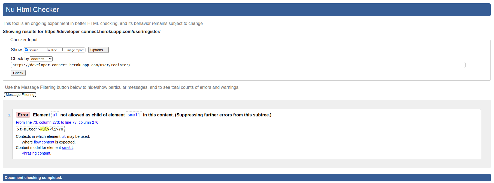 | Element ul not allowed as child of element small in this context - This is part of the form created by Allauth as part of social account login and so this error was ignored. |
| Login page | [WC3](https://validator.w3.org/nu/?showsource=yes&doc=https%3A%2F%2Fdeveloper-connect.herokuapp.com%2Fuser%2Flogin%2F) |  | Pass: No Errors |
| About | [W3C](https://validator.w3.org/nu/?showsource=yes&doc=https%3A%2F%2Fdeveloper-connect.herokuapp.com%2Fabout) |  | Pass: No errors |
| Developer Overview (not logged in) | [W3C](https://validator.w3.org/nu/?showsource=yes&doc=https%3A%2F%2Fdeveloper-connect.herokuapp.com%2Fdevelopers%2F) | 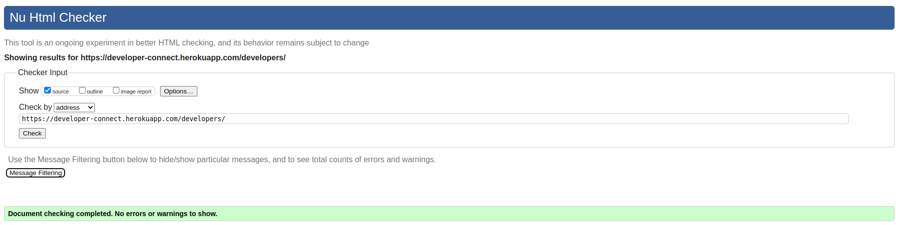 | Pass: No Errors |
| Developer Overview (logged in) | n/a |  | Pass: No Errors |
| Project Overview (not logged in) | [WC3](https://validator.w3.org/nu/?showsource=yes&doc=https%3A%2F%2Fdeveloper-connect.herokuapp.com%2Fprojects) |  | Pass: No Errors |
| Project Overview (logged in) | n/a |  | Pass: No Errors |
| My Profile | n/a |  | Stray end tag div. I was unable to locate the stray `</div>` tag in this case |
| Edit Profile | n/a |  | Pass: No Errors |
| Add/remove picture page | n/a |  | Stray start and end tag tr, Stray start and end tag th, Stray start and end tag td. This was within the form generated by Django, and the tags do not appear to be stray, so these errors were ignored. |
| My Messages (inbox) | n/a |  | Pass: No Errors |
| My Messages (outbox) | n/a |  | Pass: No Errors |
| Individual Message (as sender) | n/a | 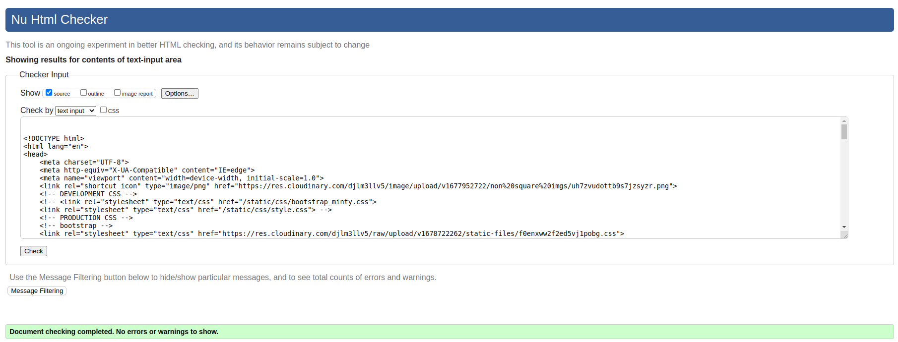 | Pass: No Errors |
| Individual Message (as recipient) | n/a | 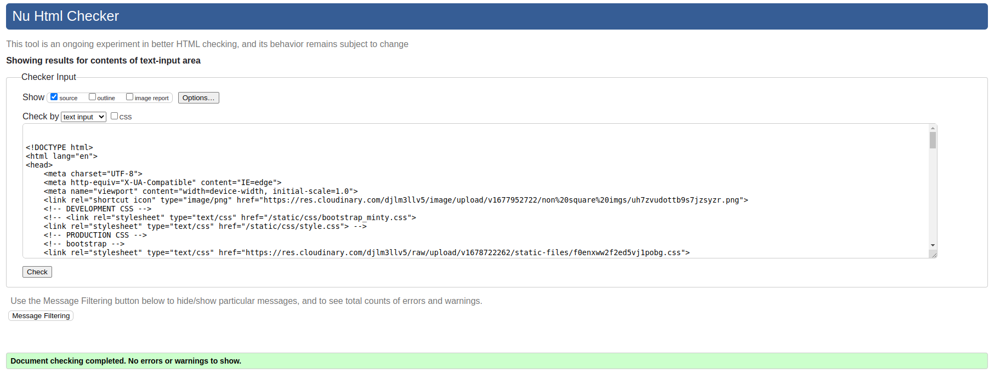 | Pass: No Errors |
| New Message | n/a |  | Pass: No Errors |
| Edit Message | n/a |  | Pass: No Errors |
| Other user profile | n/a |  | Stray end tag a - this was removed |
| Individual Project | n/a | 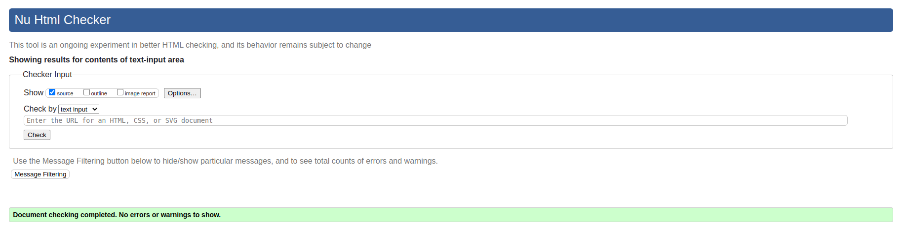 | Pass: No Errors |
| Create Project | n/a |  | Pass: No Errors |
| Edit Project | n/a |  | Pass: No Errors |
| Project picture page | n/a | 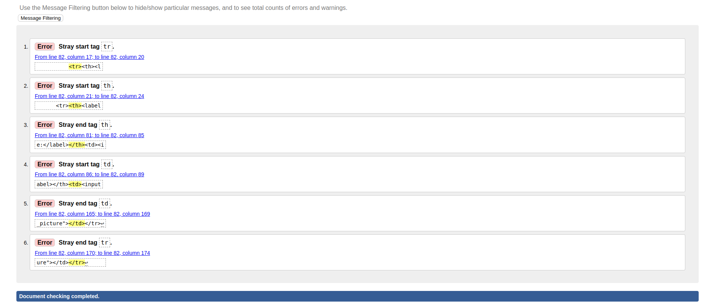 | Stray start and end tag tr, Stray start and end tag th, Stray start and end tag td. This was within the form generated by Django, and the tags do not appear to be stray, so these errors were ignored. |
| Google sign in page | [W3C](https://developer-connect.herokuapp.com/user/google/login/?next=/) |  | Many validation errors present, but these are part of the google log in from Allauth and were therefore ignored. |


### CSS

I have used the recommended [CSS Jigsaw Validator](https://jigsaw.w3.org/css-validator) to validate all of my CSS files.

There are two sources for the CSS for the website - most comes from an import of Bootstrap and some comes from a custom CSS file (static/css/style.css). The Jigsaw validator attempted to validate all the CSS from the site, but any errors or warnings arising from the Bootstrap import were ignored in this case as they come from a third party.

Below is a table summary for the CSS code validation.

| File | Jigsaw URL | Screenshot | Notes |
| --- | --- | --- | --- |
| style.css | [Jigsaw](https://jigsaw.w3.org/css-validator/validator?uri=https%3A%2F%2Fdeveloper-connect.herokuapp.com%2F&profile=css3svg&usermedium=all&warning=1&vextwarning=&lang=en) | 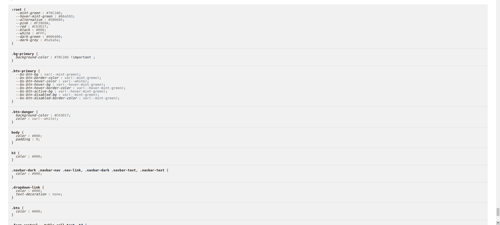 | Pass: No Errors (custom CSS code can be seen at the bottom of the "validated CSS" section) |
| checkout.css | [Jigsaw](https://jigsaw.w3.org/css-validator/validator?uri=https%3A%2F%2Fdeveloper-connect.herokuapp.com%2F&profile=css3svg&usermedium=all&warning=1&vextwarning=&lang=en) |  | 17 errors, all coming from bootstrap import |
| x | [Jigsaw](https://jigsaw.w3.org/css-validator/validator?uri=https%3A%2F%2Fdeveloper-connect.herokuapp.com%2F&profile=css3svg&usermedium=all&warning=1&vextwarning=&lang=en) |  | 368 warnings, all coming from bootstrap import |

### JavaScript

No Javascript was used in this project.

### Python

I have used the recommended [CI Python Linter](https://pep8ci.herokuapp.com) to validate all of my Python files.
In addition, I used the [Black](https://pypi.org/project/black/) pep8 validation tool, installed into my VSCode environment throughout the development of the project.

In the settings.py file, there are 4 lines which come as default with Django which throw a "line too long" error and cannot be broken down without compromising code functionality. For these lines (settings.py 184, 189, 194 and 199) have had the `# noqa` comment added to the end of them to exclude them from code validation. These are the only lines which are exempted in this way.


```python
AUTH_PASSWORD_VALIDATORS = [
    {
        "NAME": "django.contrib.auth.password_validation.UserAttributeSimilarityValidator",  # noqa
    },
    {
        "NAME": "django.contrib.auth.password_validation.MinimumLengthValidator",  # noqa
    },
    {
        "NAME": "django.contrib.auth.password_validation.CommonPasswordValidator",  # noqa
    },
    {
        "NAME": "django.contrib.auth.password_validation.NumericPasswordValidator",  # noqa
    },
]
```

Below are the results of running the [Code Institute PEP8 linter](https://pep8ci.herokuapp.com/):

| File | CI URL | Screenshot | Notes |
| --- | --- | --- | --- |
| app_home/tests/test_home_views.py | [CI PEP8](https://pep8ci.herokuapp.com/https://raw.githubusercontent.com/dragon-fire-fly/developer_matcher/main/app_home/tests/test_home_views.py) |  | Pass: No Errors |
| app_home/forms.py | [CI PEP8](https://pep8ci.herokuapp.com/https://raw.githubusercontent.com/dragon-fire-fly/developer_matcher/main/app_home/forms.py) |  | Pass: No Errors |
| app_home/urls.py | [CI PEP8](https://pep8ci.herokuapp.com/https://raw.githubusercontent.com/dragon-fire-fly/developer_matcher/main/app_home/urls.py) |  | Pass: No Errors |
| app_home/views.py | [CI PEP8](https://pep8ci.herokuapp.com/https://raw.githubusercontent.com/dragon-fire-fly/developer_matcher/main/app_home/views.py) |  | Pass: No Errors |
| app_user/tests/test_user_models.py | [CI PEP8](https://pep8ci.herokuapp.com/https://raw.githubusercontent.com/dragon-fire-fly/developer_matcher/main/app_user/tests/test_user_models.py) |  | Pass: No Errors |
| app_user/tests/test_user_views.py | [CI PEP8](https://pep8ci.herokuapp.com/https://raw.githubusercontent.com/dragon-fire-fly/developer_matcher/main/app_user/tests/test_user_views.py) |  | Pass: No Errors |
| app_user/admin.py | [CI PEP8](https://pep8ci.herokuapp.com/https://raw.githubusercontent.com/dragon-fire-fly/developer_matcher/main/app_user/admin.py) |  | Pass: No Errors |
| app_user/forms.py | [CI PEP8](https://pep8ci.herokuapp.com/https://raw.githubusercontent.com/dragon-fire-fly/developer_matcher/main/app_user/forms.py) |  | Pass: No Errors |
| app_user/models.py | [CI PEP8](https://pep8ci.herokuapp.com/https://raw.githubusercontent.com/dragon-fire-fly/developer_matcher/main/app_user/models.py) | 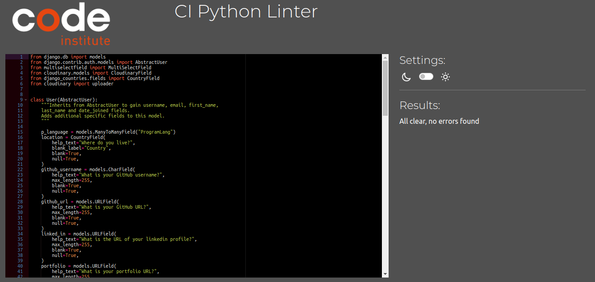 | Pass: No Errors |
| app_user/urls.py | [CI PEP8](https://pep8ci.herokuapp.com/https://raw.githubusercontent.com/dragon-fire-fly/developer_matcher/main/app_user/urls.py) |  | Pass: No Errors |
| settings.py | [CI PEP8](https://pep8ci.herokuapp.com/https://raw.githubusercontent.com/dragon-fire-fly/developer_matcher/main/developer_matcher/settings.py) |  | Pass: No Errors |
| app_user/views.py | [CI PEP8](https://pep8ci.herokuapp.com/https://raw.githubusercontent.com/dragon-fire-fly/developer_matcher/main/app_user/views.py) |  | Pass: No Errors |
| utilities.py | [CI PEP8](https://pep8ci.herokuapp.com/https://raw.githubusercontent.com/dragon-fire-fly/developer_matcher/main/developer_matcher/utilities.py) |  | Pass: No Errors |


## Browser Compatibility
I've tested my deployed project on multiple browsers to check for compatibility issues.
All screenshots in the main [README.md](README.md) file were taken on Chrome as Chrome was used during the development of this project. In addition, the application was tested on [Firefox](https://www.mozilla.org/) (on Linux) and [Safari](https://www.apple.com/safari/) (on Mac). The screenshots for these browsers can be found below.  

| Browser | Screenshot | Notes |
| --- | --- | --- |
| Firefox |  | Works as expected |
| Firefox |  | Works as expected |
| Firefox |  | Works as expected |
| Firefox | 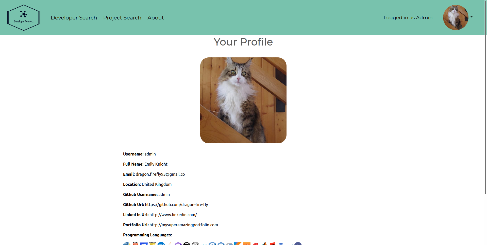 | Works as expected |
| Firefox |  | Works as expected |
| Firefox |  | Works as expected |
| Safari |  | Works as expected |
| Safari |  | Works as expected |
| Safari |  | Works as expected |
| Safari |  | Works as expected |
| Safari |  | Works as expected |
| Safari |  | Works as expected |
| Safari |  | Works as expected |
| Safari |  | Works as expected |

## Responsiveness

All pages were tested in the following 4 screen sizes:
- Small mobile device (320px)
- Large mobile device (425px)
- Tablet (768px)
- Desktop (1440px)

Screenshots of all pages in these different screen sizes may be found in the [README.md](README.md) file under "Features".

One example is provided below:


## Lighthouse Audit
I've tested my deployed project using the Lighthouse Audit tool to check for any major issues.
All scores came back with a score of at least 50, in many cases much higher than this. Most of the reasons for lower scores were due to the presence of user uploaded large image files that are not properly scaled or next-gen fomet (e.g. WebP). The pictures used for sample user accounts and projects were not updated as this would not be representative of genuine user uploaded pictures and thus would artificially skew the lighthouse scores. In the future, an image uploader could be used to convert user uploaded pictures to WebP format automatically before storage in the database.
Overall, the lighthouse scores were deemed high enough for the minimum viable product.

| Page | Screenshot | Notes |
| --- | --- | --- |
| Home  | 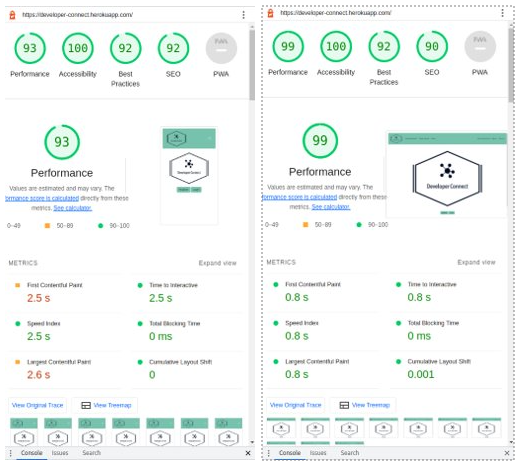 | A couple of minor warnings |
| Login |  | A couple of minor warnings |
| Register |  | A couple of minor warnings |
| About |  | A couple of minor warnings |
| Developer Overview |  | Few warnings such as slow response time due to large images, images not properly sized or in next-gen formats. Does not use HTTPS. |
| User profile |  | Few warnings such as slow response time due to large images, images not properly sized or in next-gen formats. Does not use HTTPS. |
| Edit profile |  | Few warnings such as slow response time due to large images, images not properly sized or in next-gen formats. Does not use HTTPS. |
| Profile pictures page |  | Few warnings such as slow response time due to large images, images not properly sized or in next-gen formats. Does not use HTTPS. |
| Other user profile | 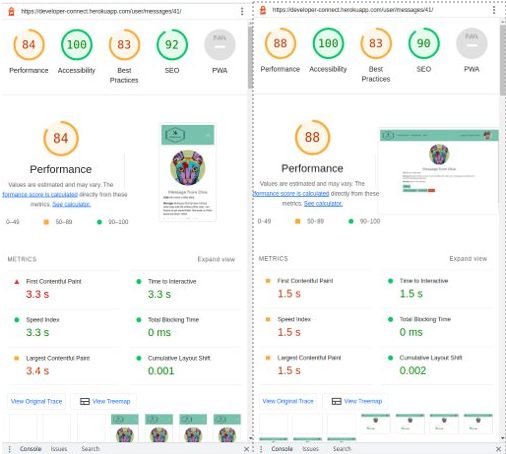 | Few warnings such as slow response time due to large images, images not properly sized or in next-gen formats. Does not use HTTPS. |
| Project Overview |  |Few warnings such as slow response time due to large images, images not properly sized or in next-gen formats. Does not use HTTPS. |
| Individual project |  | Few warnings such as slow response time due to large images, images not properly sized or in next-gen formats. Does not use HTTPS. |
| New project | 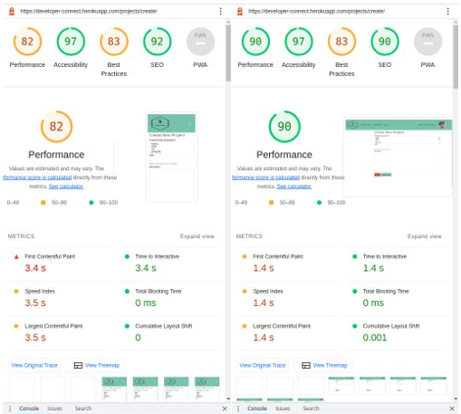 | Few warnings such as slow response time due to large images, images not properly sized or in next-gen formats. Does not use HTTPS. |
| Edit project |  | Few warnings such as slow response time due to large images, images not properly sized or in next-gen formats. Does not use HTTPS. |
| Project pictures |  | Few warnings such as slow response time due to large images, images not properly sized or in next-gen formats. Does not use HTTPS. |
| Messages |  | Few warnings such as slow response time due to large images, images not properly sized or in next-gen formats. Does not use HTTPS. |
| New message | 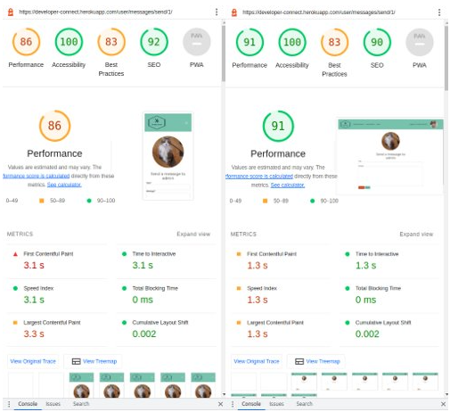 | Few warnings such as slow response time due to large images, images not properly sized or in next-gen formats. Does not use HTTPS. |
| Edit message | 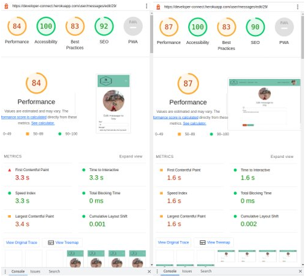 | Few warnings such as slow response time due to large images, images not properly sized or in next-gen formats. Does not use HTTPS. |

## Accessibility
Accessibility of websites is extremely important so that users from all backgrounds can enjoy a website. Good website accessibility includes easy to read text (with a good contrast between text and background) as well as appropriately labelling elements so they may be read by screen reader technology.

### Eightshapes
Contrast between the colours used in this project were assessed using an [eight-shapes contrast grid](https://contrast-grid.eightshapes.com/?version=1.1.0&background-colors=&foreground-colors=%23FFFFFF%2C%20White%0D%0A%23000%0D%0A%235A5A5A%0D%0A%2378C2AD%0D%0A%23F3969A%0D%0A%23C63D17%0D%0A%23FFCE67%0D%0A%23006400&es-color-form__tile-size=compact&es-color-form__show-contrast=aaa&es-color-form__show-contrast=aa&es-color-form__show-contrast=aa18&es-color-form__show-contrast=dnp). This gives a rating to show whether two colours are suitable to use together in terms of accessibility. If the rating is less than 4.5 (AA rating), the colour combination should not be used to display text on background (unless the text is very large). A combination with a rating of less than 3 (AA18 rating) should never be used.  

  
Following this assessment, many of the colour combinations on the site were changed to improve the contrast and make the site more accessible. In most cases, this resulted in white text being changed to dark grey or black. Some examples are shown below:  


### WAVE Accessibility Testing
| Page | Screenshot(s) | Notes |
| --- | --- | --- |
| Home  |  | Pass: No errors or alerts |
| Login  |  | 2 x redundant links because the login page contains a link to iteslf (in the navbar) and 2 links to the register page. These alerts were ignored as one link is in the nav bar and the other came with Django Allauth |
| Register  |  | 1 x redundant links because the register page contains a link to iteslf (in the navbar). This alert was ignored as the redundant link is in the navbar |
| About  |  | Pass: No errors or alerts |
| Developer Overview  |  | 8 alerts due to redundant links (both the image and title lead to the individual profile page). These alerts were ignored as this was a design choice for the site. To remove these alerts, the <a> tag on either the image or the title could be removed. |
| Individual profile  |  | Pass: No errors or alerts |
| Project Overview  |  | 5 alerts due to redundant links (both the image and title lead to the individual project page). These alerts were ignored as this was a design choice for the site. To remove these alerts, the <a> tag on either the image or the title could be removed. |
| Individual project  |  | Pass: No errors or alerts |
| Edit project  |  | Pass: No errors or alerts |
| User Profile  |  | 1 alert due to "suspicious alternative text" as the alt text is "Your profile image". This was not updated to something more descriptive, as this field is a user uploaded image and is it therefore unknown what a more appropriate image description could be. |
| Profile pictures  |  | 2 x alerts due to "suspicious alternative text" as the alt text is "Your profile image". This was not updated to something more descriptive, as this field is a user uploaded image and is it therefore unknown what a more appropriate image description could be. There was also 1 alert as "A nearby image has the same alternative text". This is due to the alt-text field being generated in a for loop and therefore each user uploaded image has the same alt text. |
| Edit profile  |  | Pass: No errors or alerts |
| Messages inbox  |  | 1 redundant link present as both the thumbnail img and the user name lead to the user's individual profile. This alert was ignored as this was a design choice. To remove this alert, the <a> tag on either the image or the user name could be removed. |
| Messages sent items  |  | The WAVE assessment tool identified 3 errors due to "empty links". However, when the code is inspected, there is infact  |
| New message  |  | Pass: No errors or alerts |
| Edit message  |  | Pass: No errors or alerts |


## Defensive Programming
Definsive programming techniques have been applied to this project to ensure correct security is in place and that users can only access areas they are supposed to have access to. This includes form validation, which is illustrated below.


Defensive programming was manually tested with the below user acceptance testing:

| Page | User Action | Expected Result | Pass/Fail | Comments |
| --- | --- | --- | --- | --- |
| Home Page | | | | |
| | Click on Logo | Redirection to Home page | Pass | |
| | Click on sign up button | Redirection to registration page | Pass | |
| | Click on sign in button | Redirection to sign in page | Pass | |
| Developer Search Page | | | | |
| | Click on Developer Search link in navbar (not logged in) | Redirection to Developer Overview page which only displays sign in and sign up buttons | Pass | |
| | Click on Developer Search link in navbar (logged in) | Redirection to Developer Overview page with full contents | Pass | |
| | Click "next" page | Redirected to page 2 of the Developer overview | Pass | |
| | Click page "2" | Redirected to page 2 of the Developer overview | Pass | |
| | Click "previous" page on page 1 | No redirection occurs as this button is disabled | Pass | |
| | Click on name of individual user | Redirected to that user's profile | Pass | |
| | Submit a filter query | The users are filtered to only those who contain all the specified programming languages | Pass | |
| Project Search Page | | | | |
| | Click on Project Search link in navbar (not logged in) | Redirection to Project Overview page which only displays sign in and sign up buttons | Pass | |
| | Click on Project Search link in navbar (logged in) | Redirection to Project Search page with full contents | Pass | |
| | Click "next" page | Redirected to page 2 of the Project overview | Pass | |
| | Click page "2" | Redirected to page 2 of the Project overview | Pass | |
| | Click "previous" page on page 1 | No redirection occurs as this button is disabled | Pass | |
| | Click on name of individual project | Redirected to that project page | Pass | |
| | Submit a filter query | The projects are filtered to only those who contain all the specified programming languages | Pass | |
| | Click the "Create a New Project" button | Redirection to new project creation form | Pass | |
| | Select programming languages | Multiple choices may be selected by holding Ctrl or Shift | Pass | |
| | Enter valid title | Field will accept text up to 100 chars, then stops more chars being typed. Will return an error if project title is already taken (case sensitive) or if title contains a profanity | Pass | |
| | Enter description in textarea | Field will accept freeform text, optional | Pass | |
| | Click the Submit button | Redirects user to project overview page where the newly created project will have been added | Pass | |
| | Click the "Edit Project" button on user's own individual project | Redirects user to project edit form | Pass | |
| | Brute forcing the URL to edit another user's project | The project ID is in the url, but if the logged in user is not the project owner, they are redirected back to the project overview page | Pass | |
| | Brute forcing the HTML to delete another user's project | The ID used for project deletion may be manipulated by viewing page source and changing the value in the deletion modal. However, if the logged in user is not the project owner, the project is not deleted and the user is returned to the project overview page. | Pass | |
| Sign Up | | | | |
| | Click on Sign Up button | Redirection to Sign Up page | Pass | |
| | Enter valid username | Field will accept up to 150 chars, no duplicates to an existing user (case sensitive) and no profanities | Pass | |
| | Enter valid email address | Field will only accept email address format | Pass | |
| | Enter valid password (twice) | Field will only accept password format | Pass | |
| | Click on Sign Up button | Signs user in and redirects to home page | Pass | |
| Log In | | | | |
| | Click on the Login link | Redirection to Login page | Pass | |
| | Enter valid username | Field will accept freeform text  | Pass | |
| | Enter valid password | Field will only accept password format | Pass | |
| | Click Login button | Signs user in and redirects to home page | Pass | |
| Log Out | | | | |
| | Click Logout button | Redirects user to logout page | Pass | Confirms logout first |
| | Click Confirm Logout button | Signs user out and redirects to home page | Pass | |
| Profile | | | | |
| | Click on Profile button | User will be redirected to the Profile page | Pass | |
| | Click on the Edit button | User will be redirected to the edit profile page | Pass | |
| | Click on the My Messages link | User will be redirected to the My Messages page | Pass | |
| | Brute forcing the URL to get to another user's personal profile | This URL was designed not to contain any ids or usernames so this is not possible. The profile gets the user details directly from the request | Pass | R |
| | Brute forcing the URL to edit another user's personal profile | This URL was designed not to contain any ids or usernames so this is not possible. The profile gets the user details directly from the request | Pass |  |
| | Brute forcing the URL to delete another user's personal profile | This URL was designed not to contain any ids or usernames so this is not possible. The profile gets the user details directly from the request | Pass |  |
| Messages | | | | |
| | Click on My Messages in dropdown menu | User will be redirected to the Messages (inbox) page | Pass | |
| | Click on Sent Messages button | User will be redirected to the Messages (sent messages) page | Pass | |
| | Click on individual message | User will be redirected to that specific message page | Pass | |
| | Brute forcing the URL to read another user's message | This URL contains the id of the message which can be manipulated, but if a user enters the id of message for which they are not the sender or intended recipient, they will be redirected to the message inbox | Pass |  |
| | Brute forcing the URL to edit another user's message | This URL contains the id of the message which can be manipulated, but if a user enters the id of message for which they are not the sender, they will be redirected to the message inbox | Pass |  |
| | Brute forcing the URL to delete another user's message | The ID used for message deletion may be manipulated by viewing page source and changing the value in the deletion modal. However, if the logged in user is not the message sender or intended recipient, the message is not deleted and the user is returned to the message inbox | Pass |  |

## User Story Testing

Each of the User Stories mentioned in the [README.md](README.md) file were tested to ensure correct functionality and complete implementation of the User Story.

[User Story testing](https://docs.google.com/spreadsheets/d/1gGXyeVyqV9Qn-6OWgzcTl8FbropnZFla_UFe-G648LY/edit#gid=0) is linked here in an external Google sheet.

For each User Story, the Epic to which the User Story belongs is listed along with the user story number, the title of the User Story, it's MoSCow prioritation and each of the acceptance criteria for the User Story. There is then a column each for whether the feature was implemented and (if implemented) whether it is working correctly. There is also a screenshot where relevant to demonstrate the implementation of the User Sotry.


## Automated Testing

I have conducted a series of automated tests on my application.

I fully acknowledge and understand that, in a real-world scenario, an extensive set of additional tests would be more comprehensive.

### Python (Unit Testing)
I have used Django's built-in unit testing framework to test the application functionality.

In order to run the tests, I ran the following command in the terminal each time:

`python3 manage.py test name-of-app `


The unittests run for the project are listed below, seperated by Django app and file (models or views)

For **app_user** app:  
**views.py**  

| Function Tested  | Function Type  |  Testing for.. | Assert Statement   |  Pass |
|---|---|---|---|---|
| User Registration  | get   | Starting number of users is 0  | self.assertEqual(User.objects.count(), 0)  | pass  |
|   |    | registration page loads successfully  | self.assertEqual(response.status_code, 200)  | pass  |
|   |    | correct template is used for registration  | self.assertTemplateUsed(response, "app_user/register.html")  | pass  |
|   | post   | redirection following registration  | self.assertEqual(response.status_code, 302)  | pass  |
|   |    | user redirected correctly to user profile after signing up  | self.assertRedirects(response, "/user/profile/")  | pass  |
|   |    | user was added to the database  | self.assertEqual(User.objects.count(), 1)  | pass  |
|   |    | user logged in and authenticated after signup  | self.assertTrue(newly_created_user.is_authenticated)  | pass  |
|   |    | signup date is correctly added  | self.assertTrue(newly_created_user.date_joined, datetime.now())  | pass  |
|   |    | no new user was created if incorrect credentials supplied  | self.assertEqual(User.objects.count(), 0)  | pass  |
|   |    | browser rerenders the form for submission again  | self.assertEqual(response.status_code, 200)  | pass  |
|   |    | browser rerenders the form for submission again  | self.assertTemplateUsed(response, "app_user/register.html")  | pass  |
| User login  | get  |  login form successfully loaded  |  self.assertEqual(response.status_code, 200) | pass  |
|   |   |  login template used  | self.assertTemplateUsed(response, "account/login.html")  | pass  |
|   |   | user is authenticated following login  | self.assertTrue(test_user.is_authenticated)  | pass  |

**models.py**
| Model Tested  | Function Type  |  Testing for.. | Assert Statement   |  Pass |
|---|---|---|---|---|
| user model  |    | `__str__` method  | self.assertEqual(str(self.user), "<user: testuser>")  | pass  |
|   |    | `to_json` method  | self.assertEqual(self.user.to_json(), expected_output)  | pass  |
|   |    | user profile picture uploaded  | self.assertEqual(profile_picture.profile_picture, cloudinary_field_mock.return_value)  | pass  |
| project model  |    | `__str__` method project 1 | self.assertEqual(str(self.project1), "<Project name: Test Project 1>")  | pass  |
|   |    | `__str__` method project 2  | self.assertEqual(str(self.project2), "<Project name: Test Project 2>")  | pass  |
|   |    | project 1 user count = 1  | self.assertEqual(self.project1.user.count(), 1)  | pass  |
|   |    | project 1 p language count = 1  | self.assertEqual(self.project1.p_language.count(), 1)  | pass  |
|   |    | project 2 user count = 2  | self.assertEqual(self.project2.user.count(), 2)  | pass  |
|   |    | project 2 p language count = 2  | self.assertEqual(self.project2.p_language.count(), 2)  | pass  |
|   |    | project picture upload  | self.assertEqual(project_picture.project_picture, cloudinary_field_mock.return_value)  | pass  |


For **app_home** app:  
**views.py**  
Home and about views
| Function Tested  | Function Type  | Status | Testing for.. | Assert Statement   |  Pass |
|---|---|---|---|---|---|
| Home view  | get  | not logged in  | correct template used| self.assertTemplateUsed(template)  | pass  |
|   |   |   | status code 200 (success) |  self.assertEqual(response.status_code, 200)  | pass  |
|   |   |   | Response contains... |  self.assertContains(response, "Please log in to continue")  | pass  |
|   |   | logged in user  | correct template used |  self.assertTemplateUsed(template)  | pass  |
|   |   |   | status code 200 (success) |  self.assertEqual(response.status_code, 200)  | pass  |
|   |   |   | Response doesn't contain... |  self.assertNotContains(response, "Please log in to continue")  | pass  |
| About view  | get  | any  | correct template used |  self.assertTemplateUsed(template)  | pass  |
|   |   |   | status code 200 (success) |  self.assertEqual(response.status_code, 200)  | pass  |


View other users
| Function Tested  | Function Type  | Status | Testing for.. | Assert Statement   |  Pass |
|---|---|---|---|---|---|
| Developer Overview page  | get  | not logged in  | correct template used |  self.assertTemplateUsed(template)  | pass  |
|   |   |   | status code 200 (success) |  self.assertEqual(response.status_code, 200)  | pass  |
|   |   |   | Response contains... |  self.assertContains(response, "Please log in or register to see the Developer Overview")  | pass  |
|   |   | logged in user  | correct template used |  self.assertTemplateUsed(template)  | pass  |
|   |   |   | status code 200 (success) |  self.assertEqual(response.status_code, 200)  | pass  |
|   |   |   | Response doesn't contain... |  self.assertNotContains(response, "Please log in or register to see the Developer Overview")  | pass  |
| Profile detail view (successful)  | get  | not logged in  | status code 302 (redirect) |  self.assertEqual(response.status_code, 302)  | pass  |
|   |   |   |  redirection url |  self.assertRedirects(response, f"/user/login/?next={url}")  | pass  |
|   |   | logged in user  | status code 200 (success) |  self.assertEqual(response.status_code, 200)  | pass  |
|   |   |   | correct template used |  self.assertTemplateUsed(response, template)  | pass  |
|   |   |   | check response contains user1 |  self.assertEqual(response.context["user"], self.user1)  | pass  |
|   |   |   | check response contains user2 |  self.assertEqual(response.context["user_for_profile"], self.user2)  | pass  |
| Profile detail view (profile does not exist)  | get  | logged in  | status code 404 (not found) |  self.assertEqual(response.status_code, 404)  | pass  |

View projects
| Function Tested  | Function Type  | Status | Testing for.. | Assert Statement   |  Pass |
|---|---|---|---|---|---|
| View project overview  | get  | not logged in  | correct template used |  self.assertTemplateUsed(template)  |   |
|   |   |   | status code 200 (success) |  self.assertEqual(response.status_code, 200)  |   |
|   |   |   | Response contains... |  self.assertContains(response, "Please log in or register to see projects")  | pass  |
|   |   | logged in user  | status code 200 (success) |  self.assertEqual(response.status_code, 200)  | pass  |
|   |   |   | correct template used |  self.assertTemplateUsed(response, template)  | pass  |
|   |   |   | Response contains... |  self.assertContains(response, self.project1.title)  | pass  |
|   |   |   | Response contains... |  self.assertContains(response, self.project2.title)  | pass  |
| View project overview (no projects)  | get  |   | status code 200 (success) |  self.assertEqual(response.status_code, 200)  | pass  |
|   |   |   | correct template used |  self.assertTemplateUsed(response, template)  | pass  |
|   |   |   | Response doesn't contain... |  self.assertNotContains(response, self.project1.title)  | pass  |
|   |   |   | Response doesn't contain... |  self.assertNotContains(response, self.project2.title)  | pass  |
| View project details  | get  | not logged in  | status code 302 (redirect) |  self.assertEqual(response.status_code, 302)  | pass  |
|   |   |   | redirection url |  self.assertRedirects(response, f"/user/login/?next={url}")  | pass  |
|   |   | user logged in  | status code 200 (success) |  self.assertEqual(response.status_code, 200)  | pass  |
|   |   |   | correct template used |  self.assertTemplateUsed(response, template)  | pass  |
|   |   |   | Response contains... |  self.assertContains(response, self.project1.title)  | pass  |
| View project details (project does not exist)  | get  | logged in user  | status code 404 (not found) |  self.assertEqual(response.status_code, 404)  | pass  |

Create a new project
| Function Tested  | Function Type  | Status | Testing for.. | Assert Statement   |  Pass |
|---|---|---|---|---|---|
| Create project  | get (get form)  | not logged in  | status code 302 (redirect) |  self.assertEqual(response.status_code, 302)  | pass  |
|   |   |   | redirection url |  self.assertRedirects(response, f"/user/login/?next={url}")  | pass  |
|   |   | logged in user  | status code 200 (success) |  self.assertEqual(response.status_code, 200)  | pass  |
|   |   |   | correct template used |  self.assertTemplateUsed(response, template)  | pass  |
| Create project  | post (valid)  | logged in user  | status code 302 (redirect) |  self.assertEqual(response.status_code, 302)  | pass  |
|   |   |   | project count increased by 1 |  self.assertEqual(Project.objects.count(), project_count + 1)  | pass  |
|   |   |   | new project title = "ProjectTitle3" |  self.assertEqual(Project.objects.last().title, "ProjectTitle3")  | pass  |
|   |   |   | new project contains lang 1 and 2|  self.assertCountEqual(Project.objects.last().p_language.all(),[self.language1, self.language2],)  | pass  |
|   |   |   | new project belongs to user 1|  self.assertEqual(Project.objects.last().user.last(), self.user1)  | pass  |
| Create project  | post (invalid)  | logged in user  | status code 302 (redirect) |  self.assertEqual(response.status_code, 302)  | pass  |
|   |   |   | project count has not increased |  self.assertEqual(Project.objects.count(), project_count)  | pass  |


Edit a project
| Function Tested  | Function Type  | Status | Testing for.. | Assert Statement   |  Pass |
|---|---|---|---|---|---|
| Edit project  | get (form) | not logged in  | status code 302 (redirect)  | self.assertEqual(response.status_code, 302)  | pass  |
|   |   |   | redirection url  | self.assertRedirects(response, f"/user/login/?next={url}")  | pass  |
|   |   | logged in (not project owner)  | status code 302 (redirect)  | self.assertEqual(response.status_code, 302)  | pass  |
|   |   | logged in (project owner)  | status code 200 (success)  | self.assertEqual(response.status_code, 200)  | pass  |
|   |   |   | correct template used  | self.assertTemplateUsed(response, template)  | pass  |
| Edit project  | post (valid)  | project owner  | status code 302 (redirect)  | self.assertEqual(response.status_code, 302)  | pass  |
|   |   |   | # projects has not changed  | self.assertEqual(Project.objects.count(), project_count)  | pass  |
|   |   |   | title is updated  | self.assertEqual(Project.objects.get(pk=self.project1.pk).title, "CHANGED TITLE!")  | pass  |
|   |   |   | description is updated  | self.assertEqual(Project.objects.get(pk=self.project1.pk).description,"CHANGED Project description3",)  | pass  |
|   |   |   | correct languages are saved  | self.assertCountEqual(Project.objects.get(pk=self.project1.pk).p_language.all(),[self.language1, self.language2],)  | pass  |
| Edit project  | post (invalid)  | project owner  | status code 200 (success)  | self.assertEqual(response.status_code, 200)  | pass  |
|   |   |   | correct template used  | self.assertTemplateUsed(response, template)  | pass  |
|   |   |   | # projects has not changed  | self.assertEqual(Project.objects.count(), project_count)  | pass  |
|   |   |   | title is unchanged  | self.assertEqual(Project.objects.get(pk=self.project2.pk).title, self.project2.title)  | pass  |
|   |   |   | description is unchanged  | self.assertEqual(Project.objects.get(pk=self.project2.pk).description,self.project2.description)  | pass  |
|   |   |   |  p langs are unchanged  | self.assertCountEqual(Project.objects.get(pk=self.project2.pk).p_language.all(),self.project2.p_language.all())  | pass  |

Delete a project
| Function Tested  | Function Type  | Status | Testing for.. | Assert Statement   |  Pass |
|---|---|---|---|---|---|
| Delete project  | get | not logged in   | status code 302 (redirect)  | self.assertEqual(response.status_code, 302)  | pass  |
|   |   |   | redirection url  | self.assertRedirects(response, f"/user/login/?next={url}")  | pass  |
|   |   | project owner  |  # projects has decreased by 1  | self.assertEqual(Project.objects.count(), project_count - 1)  | pass  |
|   |   |   | project 1 is no longer first in project list  | self.assertNotEqual(Project.objects.first(), self.project1)  | pass  |
|   |   |   | project 2 is now first in project list  | self.assertEqual(Project.objects.first(), self.project2)  | pass  |


Add project picture

| Function Tested | Function Type | Status | Testing for.. | Assert Statement | Pass |
|---|---|---|---|---|---|
| Add project picture  | get  | not logged in  | status code 302 (redirect)  | self.assertEqual(response.status_code, 302)  | pass  |
|   |   |   | redirection url  |  self.assertRedirects(response, f"/user/login/?next={url}") | pass  |
|   |   | project owner logged in  |   | self.assertEqual(response.status_code, 200)  | pass  |
|   |   | status code 200 (success)  | correct template used  | self.assertTemplateUsed(response, template)  | pass  |
|   | post (with mock)  | project owner  | status code 302 (redirect)  | self.assertEqual(response.status_code, 302)  | pass  |
|   |   |   | # pics increased by 1  | self.assertEqual(len(self.project1.project_pic.all()), no_pics + 1)  | pass  |

#### Unit Test Issues
The following unittest was implemented for testing the deletion of a project picture.


```python
    @mock.patch("cloudinary.uploader.upload")
    def test_delete_project_picture_post(self, mock_uploader_upload):
        # logging in project owner
        self.client.force_login(self.user1)

        # setup - add a mocked picture
        template = "app_home/project_picture.html"
        url = reverse(
            "app_home:add-project-pic", kwargs={"pk": self.project1.pk}
        )

        # number of pics before upload
        no_pics = len(self.project1.project_pic.all())
        # mocking
        mock_uploader_upload = "picture.jpg"
        # define URL & image
        mocked_picture = SimpleUploadedFile(
            "picture.jpg", b"file_content", content_type="image/jpeg"
        )
        # add the mocked picture to the project
        response = self.client.post(url, {"project_picture": mocked_picture})

        # check that mocked picture is set
        self.assertEqual(len(self.project1.project_pic.all()), no_pics + 1)
        picture_object = self.project1.project_pic.get(project=self.project1.pk)

        # now delete the mocked picture
        template = "app_home/project_picture.html"
        url = reverse(
            "app_home:delete-project-pic", kwargs={"pk": picture_object.pk}
        )
        response = self.client.get(url)
        # test that the picture is deleted
        self.assertEqual(len(self.project1.project_pic.all()), no_pics)

```

Throughout development, this test was working, however, at some later point it was returning the error `IndexError: list index out of range` in reference to the `picture_object = self.project1.project_pic.get(project=self.project1.pk)` variable assignment.


It is unclear why this error should be thrown, and when investigating using a breakpoint, the `self.project1.project_pic.get(project=self.project1.pk)` variable is correctly accessible.


 Delete project picture

| Function Tested | Function Type | Status | Testing for.. | Assert Statement  |
|---|---|---|---|---|
| Delete project pic  | get  | project owner  | ensure that mocked picture has been added first  | self.assertEqual(len(self.project1.project_pic.all()), no_pics + 1)    |
|   |   |   | mocked picture has been deleted  | self.assertEqual(len(self.project1.project_pic.all()), no_pics)    |

### GitHub CI  
For this project, a [Continuous Integration (CI) workflow](https://github.com/dragon-fire-fly/developer_matcher/actions) was implemented using GitHub Actions. This means that the requested tests may be run on the project each time a push or a pull request is performed. The specifics of the CI workflow can be found in the [ci.yml file in the project](https://github.com/dragon-fire-fly/developer_matcher/blob/main/.github/workflows/ci.yml). The CI performs 15 steps including importing requirements, making relevant database migrations, performing unittests and performing a pep8 compliance check using Black (with a custom line-length of 79 characters).

Once set up, a CI worflow is extremely helpful for monitoring the quality of the code and ensuring that all unittests continue to run successfully when code is altered or added to.

An example of a successful ci run is shown below:  


## Bugs  
### GitHub **Issues**  
Bugs were tracked from the start of the project using **GitHub Issues**
A custom [**Bug Report Template**](https://github.com/dragon-fire-fly/developer_matcher/issues/new?assignees=dragon-fire-fly&labels=bug&template=bug_report.md&title=%5BBUG%5D) was created for the purpose of concisely and accurately tracking bugs at the time they were discovered.

**Fixed Bugs**  
Closed bug issues may be found on [GitHub Issues](https://github.com/dragon-fire-fly/developer_matcher/issues?q=is%3Aissue+is%3Aclosed+BUG) and are also listed in the table below.

| Issue no.  | Bug name  | Milestone  | Fixed |
|---|---|---|---|
| 13  | [SetUp - SystemCheckError](https://github.com/dragon-fire-fly/developer_matcher/issues/13)  | Account Management  | Yes  |
| 14  | [InconsistentMigrationHistory Error](https://github.com/dragon-fire-fly/developer_matcher/issues/14)  | Account Management  | Yes  |
| 15  | [IntegrityError](https://github.com/dragon-fire-fly/developer_matcher/issues/15)  | Account Management  | Yes  |
| 16  | [Sign up form not valid](https://github.com/dragon-fire-fly/developer_matcher/issues/16)  | Account Management  | Yes  |
| 17  | [Checkboxes not displaying correctly](https://github.com/dragon-fire-fly/developer_matcher/issues/17)  | Account Management  | Yes  |
| 37  | [Projects cannot be viewed if the project owner no longer exists](https://github.com/dragon-fire-fly/developer_matcher/issues/37)  | Project Interation  | Yes  |
| 38  | [The first photo is always deleted when a user tries to delete a photo](https://github.com/dragon-fire-fly/developer_matcher/issues/38)  | User Interation  | Yes  |
| 45  | [Checkboxes are not rendered pre-checked](https://github.com/dragon-fire-fly/developer_matcher/issues/45)  | User Interation  | Yes  |
| 63  | [Registration page not loading](https://github.com/dragon-fire-fly/developer_matcher/issues/63)  | Account Management  | Yes  |
| 64  | [Delete user profile not working](https://github.com/dragon-fire-fly/developer_matcher/issues/64)  | Account Management  | Yes  |
| 71  | [Wrong user being shown when editing message](https://github.com/dragon-fire-fly/developer_matcher/issues/71)  | User Interation  | Yes  |
| 72  | ['edited' status being added to new messages](https://github.com/dragon-fire-fly/developer_matcher/issues/72)  | User Interation  | Yes  |
| 74  | [Developer overview page pagination problem](https://github.com/dragon-fire-fly/developer_matcher/issues/74)  | User Interation  | Yes  |


**Open Issues**  

Any remaining open issues can be tracked [here](https://github.com/dragon-fire-fly/developer_matcher/issues).

## Unfixed Bugs  

There are no remaining bugs that I am aware of.
