# Testing

Return back to the [README.md](README.md) file.

## Code Validation
### HTML

I have used the recommended [HTML W3C Validator](https://validator.w3.org) to validate all of my HTML files.
Pages which do not require a user to be logged in have been validated using the live link. The source code of pages that require log in to be viewed were manually tested by visiting each page, right clicking and selecting "View page source". This compiled code was then copied and pasted into the W3C HTML validator. For this reason,k the W3C URL is shown as "n/a" in the table below.

| Page | W3C URL | Screenshot | Notes |
| --- | --- | --- | --- |
| Home | [W3C](https://validator.w3.org/nu/?showsource=yes&doc=https%3A%2F%2Fdeveloper-connect.herokuapp.com%2F) |  | Pass: No errors |
| Registration page | [WC3](https://validator.w3.org/nu/?showsource=yes&doc=https%3A%2F%2Fdeveloper-connect.herokuapp.com%2Fuser%2Fregister%2F) |  | Element ul not allowed as child of element small in this context - This is part of the form created by Allauth and so this error was ignored. |
| Login page | [WC3](https://validator.w3.org/nu/?showsource=yes&doc=https%3A%2F%2Fdeveloper-connect.herokuapp.com%2Fuser%2Flogin%2F) |  | Pass: No Errors |
| About | [W3C]() |  |  |
| Developer Overview (not logged in) | [W3C](https://validator.w3.org/nu/?showsource=yes&doc=https%3A%2F%2Fdeveloper-connect.herokuapp.com%2Fdevelopers%2F) |  | Pass: No Errors |
| Developer Overview (logged in) | n/a |  | Pass: No Errors |
| Project Overview (not logged in) | [WC3](https://validator.w3.org/nu/?showsource=yes&doc=https%3A%2F%2Fdeveloper-connect.herokuapp.com%2Fprojects) |  | Pass: No Errors |
| Project Overview (logged in) | n/a | 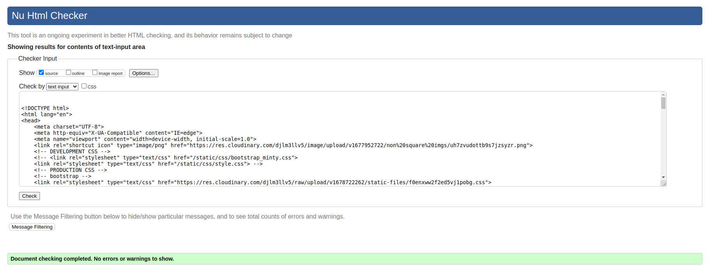 | Pass: No Errors |
| My Profile | n/a | 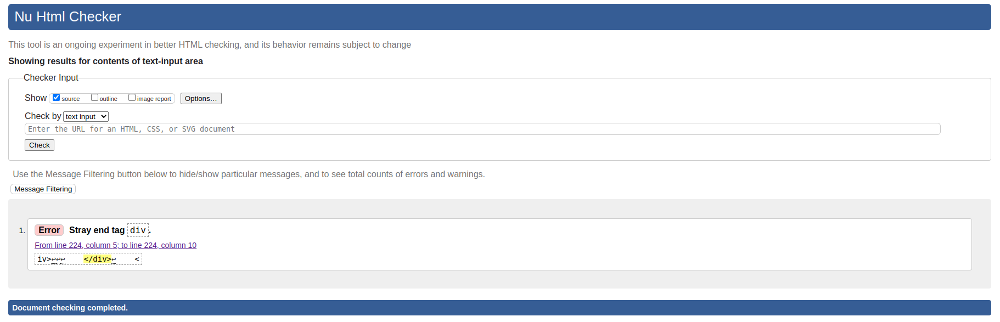 | Stray end tag div. I was unable to locate the stray `</div>` tag in this case |
| Edit Profile | n/a | 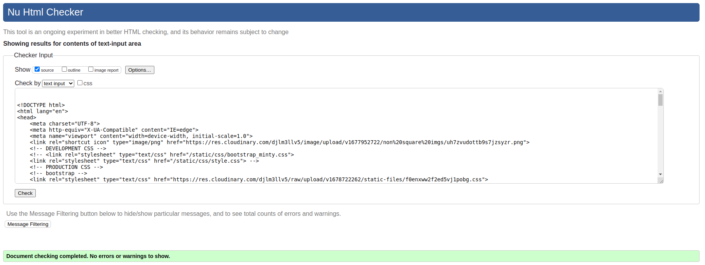 | Pass: No Errors |
| Add/remove picture page | n/a | 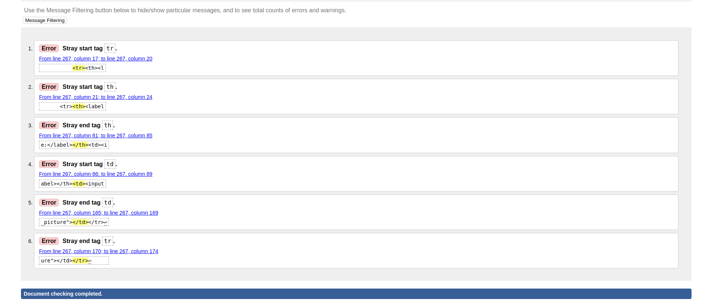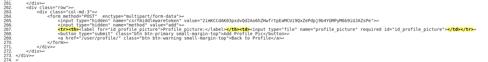 | Stray start and end tag tr, Stray start and end tag th, Stray start and end tag td. This was within the form generated by Django, and the tags do not appear to be stray, so these errors were ignored. |
| My Messages (inbox) | n/a |  | Pass: No Errors |
| My Messages (outbox) | n/a |  | Pass: No Errors |
| Individual Message (as sender) | n/a |  | Pass: No Errors |
| Individual Message (as recipient) | n/a |  | Pass: No Errors |
| New Message | n/a | 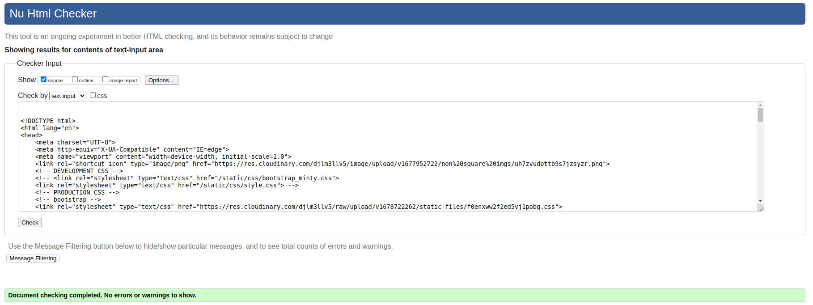 | Pass: No Errors |
| Edit Message | n/a |  | Pass: No Errors |
| Other user profile | n/a | 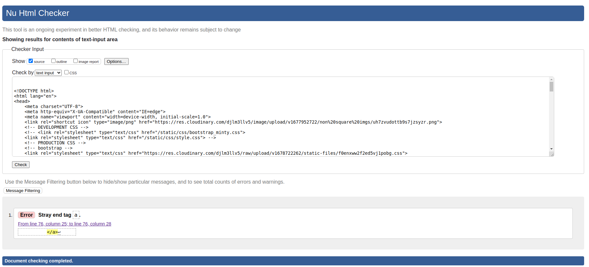 | Stray end tag a - this was removed |
| Individual Project | n/a |  | Pass: No Errors |
| Create Project | n/a | 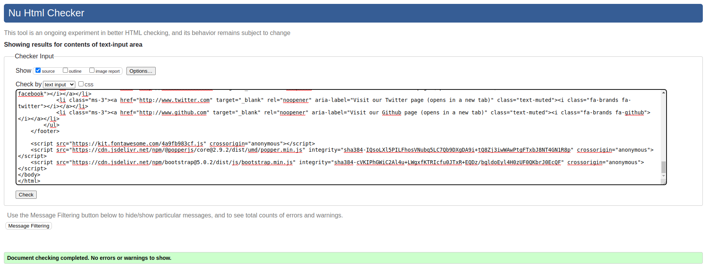 | Pass: No Errors |
| Edit Project | n/a | 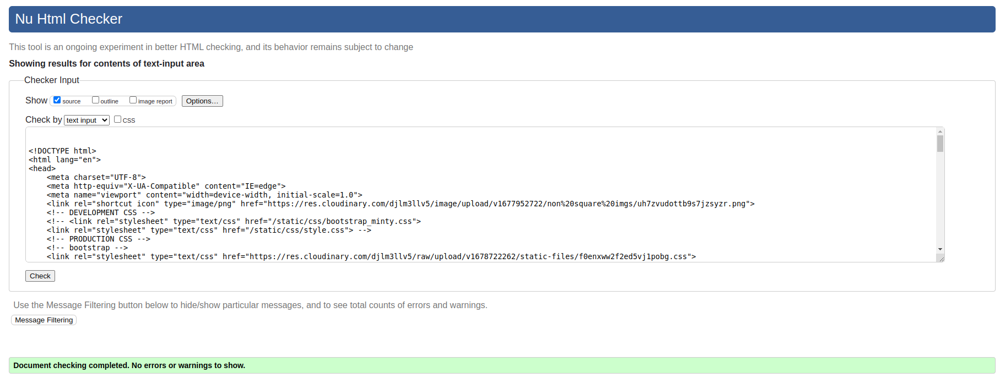 | Pass: No Errors |
| Project picture page | n/a |  | Stray start and end tag tr, Stray start and end tag th, Stray start and end tag td. This was within the form generated by Django, and the tags do not appear to be stray, so these errors were ignored. |


### CSS

I have used the recommended [CSS Jigsaw Validator](https://jigsaw.w3.org/css-validator) to validate all of my CSS files.

⚠️⚠️⚠️⚠️⚠️ START OF NOTES (to be deleted) ⚠️⚠️⚠️⚠️⚠️

- If you are copying/pasting your HTML code, use this link: https://jigsaw.w3.org/css-validator/#validate_by_input
- (*recommended*) If you are using the live deployed site, use this link: https://jigsaw.w3.org/css-validator/#validate_by_uri

It's recommended to validate the live site if you only have a single CSS file using the deployed URL.
This will give you a custom URL as well, which you can use on your testing documentation.
It makes it easier to return back to the page to validate it again in the future.
The URL will look something like this:

- https://jigsaw.w3.org/css-validator/validator?uri=https%3A%2F%2Fdragon-fire-fly.github.io%2Fdeveloper_matcher

If you have multiple CSS files, then individual [validation by input](https://jigsaw.w3.org/css-validator/#validate_by_input)
is recommended for the additional CSS files.

**IMPORTANT**: Third-Party tools

If you're using extras like Bootstrap, Materialize, Font Awesome, then sometimes the validator
will attempt to also validate this code, even if it's not part of your own actual code.
You are not required to validate the external libraries or frameworks!

Sample CSS code validation documentation (tables are extremely helpful!):

🛑🛑🛑🛑🛑 END OF NOTES (to be deleted) 🛑🛑🛑🛑🛑

| File | Jigsaw URL | Screenshot | Notes |
| --- | --- | --- | --- |
| style.css | [Jigsaw](https://jigsaw.w3.org/css-validator/validator?uri=https%3A%2F%2Fdragon-fire-fly.github.io%2Fdeveloper_matcher) |  | Pass: No Errors |
| checkout.css | n/a |  | Pass: No Errors |
| x | x | x | repeat for all remaining CSS files |

### JavaScript

No Javascript was used in this project.

### Python

I have used the recommended [CI Python Linter](https://pep8ci.herokuapp.com) to validate all of my Python files.
In addition, I used the [Black](https://pypi.org/project/black/) pep8 validation tool, installed into my VSCode environment throughout the development of the project.

⚠️⚠️⚠️⚠️⚠️ START OF NOTES (to be deleted) ⚠️⚠️⚠️⚠️⚠️

The CI Python Linter can be used two different ways.
- Copy/Paste your Python code directly into the linter.
- As an API, using the "raw" URL appended to the linter URL.
    - To find the "raw" URL, navigate to your file directly on the GitHub repo.
    - On that page, GitHub provides a button on the right called "Raw" that you can click on.
    - From that new page, copy the full URL, and paste it after the CI Python Linter URL (with a `/` separator).
    - Examples:

    | File | CI URL | Raw URL | Combined |
    | --- | --- | --- | --- |
    | PP3 *run.py* file | `https://pep8ci.herokuapp.com/` | `https://raw.githubusercontent.com/dragon-fire-fly/developer_matcher/main/run.py` | https://pep8ci.herokuapp.com/https://raw.githubusercontent.com/dragon-fire-fly/developer_matcher/main/run.py |
    | Boutique Ado *settings.py* | `https://pep8ci.herokuapp.com/` | `https://raw.githubusercontent.com/dragon-fire-fly/developer_matcher/main/boutique_ado/settings.py` | https://pep8ci.herokuapp.com/https://raw.githubusercontent.com/dragon-fire-fly/developer_matcher/main/boutique_ado/settings.py |

It's recommended to validate each file using the API URL.
This will give you a custom URL which you can use on your testing documentation.
It makes it easier to return back to a file to validate it again in the future.
Use the steps above to generate your own custom URLs for each Python file.

**IMPORTANT**: Django settings.py

The Django settings.py file comes with 4 lines that are quite long, and will throw the `E501 line too long` error.
This is default behavior, but can be fixed by adding `# noqa` to the end of those lines.

`noqa` = **NO Quality Assurance**

Example:

```python
AUTH_PASSWORD_VALIDATORS = [
    {
        "NAME": "django.contrib.auth.password_validation.UserAttributeSimilarityValidator",  # noqa
    },
    {
        "NAME": "django.contrib.auth.password_validation.MinimumLengthValidator",  # noqa
    },
    {
        "NAME": "django.contrib.auth.password_validation.CommonPasswordValidator",  # noqa
    },
    {
        "NAME": "django.contrib.auth.password_validation.NumericPasswordValidator",  # noqa
    },
]
```

**NOTE**: You must include 2 *spaces* before the `#`, and 1 *space* after the `#`.

Do not use `# noqa` all over your project just to clear down validation errors!
This can still cause a project to fail, for failing to fix actual PEP8 validation errors.

Sometimes strings or variables get too long, or long `if` conditional statements.
These are acceptable instances to use the `# noqa`.

When trying to fix "line too long" errors, try to avoid using `/` to split lines.
A better approach would be to use any type of opening bracket, and hit Enter just after that.
Any opening bracket type will work: `(`, `[`, `{`.
By using an opening bracket, Python knows where to appropriately indent the next line of code,
without having to "guess" yourself and attempt to tab to the correct indentation level.

Example:

```python
return HttpResponse(
    content=(
        f'Webhook received: {event["type"]} | '
        'SUCCESS: Verified order already in database'
    ),
    status=200
)
```

**IMPORTANT**: migration and pycache files

You do not have to ever validate files from the `migrations/` or `pycache/` folders!
Ignore these `.py` files, and validate just the files that you've created or modified.

Sample Python code validation documentation (tables are extremely helpful!):

🛑🛑🛑🛑🛑 END OF NOTES (to be deleted) 🛑🛑🛑🛑🛑

| File | CI URL | Screenshot | Notes |
| --- | --- | --- | --- |
| run.py | [CI PEP8](https://pep8ci.herokuapp.com/https://raw.githubusercontent.com/dragon-fire-fly/developer_matcher/main/run.py) |  | W291 trailing whitespace |
| settings.py | [CI PEP8](https://pep8ci.herokuapp.com/https://raw.githubusercontent.com/dragon-fire-fly/developer_matcher/main/boutique-ado/settings.py) |  | E501 line too long |
| Blog views.py | [CI PEP8](https://pep8ci.herokuapp.com/https://raw.githubusercontent.com/dragon-fire-fly/developer_matcher/main/blog/views.py) |  | Pass: No Errors |
| Checkout urls.py | [CI PEP8](https://pep8ci.herokuapp.com/https://raw.githubusercontent.com/dragon-fire-fly/developer_matcher/main/checkout/urls.py) |  | W292 no newline at end of file |
| Profiles models.py | [CI PEP8](https://pep8ci.herokuapp.com/https://raw.githubusercontent.com/dragon-fire-fly/developer_matcher/main/profiles/models.py) |  | Pass: No Errors |
| x | x | x | repeat for all remaining Python files |

## Browser Compatibility

⚠️⚠️⚠️⚠️⚠️ START OF NOTES (to be deleted) ⚠️⚠️⚠️⚠️⚠️

Use this space to discuss testing the live/deployed site on various browsers.

Consider testing at least 3 different browsers, if available on your system.

Recommended browsers to consider:
- [Chrome](https://www.google.com/chrome)
- [Firefox (Developer Edition)](https://www.mozilla.org/firefox/developer)
- [Edge](https://www.microsoft.com/edge)
- [Safari](https://support.apple.com/downloads/safari)
- [Brave](https://brave.com/download)
- [Opera](https://www.opera.com/download)

**IMPORTANT**: You must provide screenshots of the tested browsers, to "prove" that you've actually tested them.

Please note, there are services out there that can test multiple browser compatibilities at the same time.
Some of these are paid services, but some are free.
If you use these, you must provide a link to the source used for attribution, and multiple screenshots of the results.

Sample browser testing documentation:

🛑🛑🛑🛑🛑 END OF NOTES (to be deleted) 🛑🛑🛑🛑🛑

I've tested my deployed project on multiple browsers to check for compatibility issues.
All screenshots in the main [README.md](README.md) file were taken on Chrome as Chrome was used during the development of this project.

| Browser | Screenshot | Notes |
| --- | --- | --- |
| Firefox |  | Works as expected |
| Firefox | 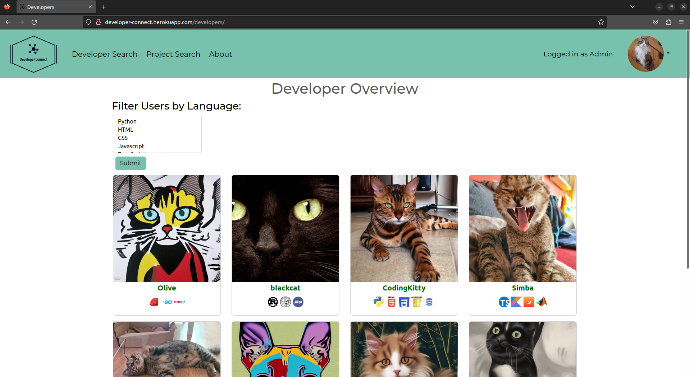 | Works as expected |
| Firefox |  | Works as expected |
| Firefox |  | Works as expected |
| Firefox | 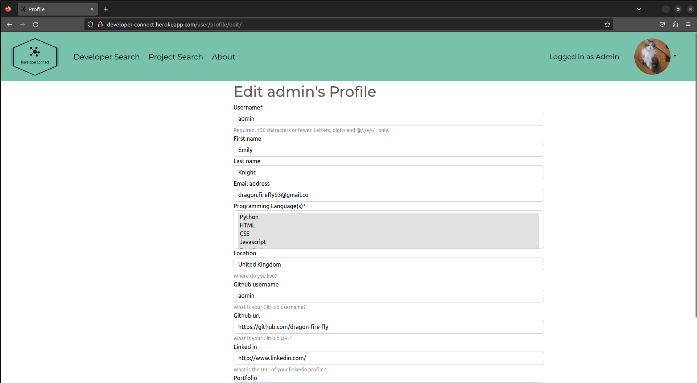 | Works as expected |
| Firefox | 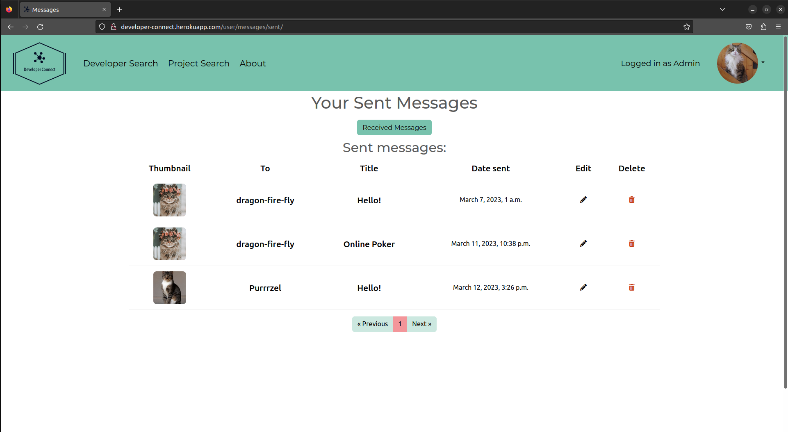 | Works as expected |
| Safari |  | Works as expected |
| Safari |  | Works as expected |
| Safari |  | Works as expected |
| Safari |  | Works as expected |
| Safari |  | Works as expected |
| Safari |  | Works as expected |
| Safari |  | Works as expected |
| Safari |  | Works as expected |

## Responsiveness

All pages were tested in the following 4 screen sizes:
- Small mobile device (320px)
- Large mobile device (425px)
- Tablet (768px)
- Desktop (1440px)

Screenshots of all pages in these different screen sizes may be found in the [README.md](README.md) file under "Features".

One example is provided below:
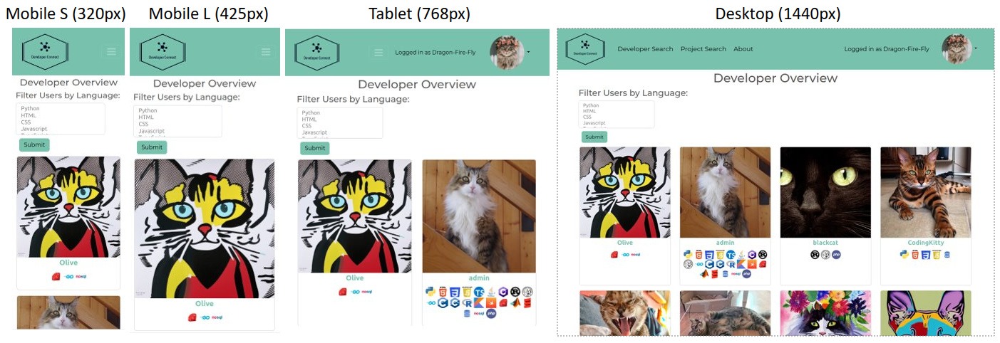

## Lighthouse Audit

⚠️⚠️⚠️⚠️⚠️ START OF NOTES (to be deleted) ⚠️⚠️⚠️⚠️⚠️

Use this space to discuss testing the live/deployed site's Lighthouse Audit reports.
Avoid testing the local version (especially if developing in Gitpod), as this can have knock-on effects of performance.

If you don't have Lighthouse in your Developer Tools,
it can be added as an [extension](https://chrome.google.com/webstore/detail/lighthouse/blipmdconlkpinefehnmjammfjpmpbjk).

Don't just test the home page (unless it's a single-page application).
Make sure to test the Lighthouse Audit results for all of your pages.

**IMPORTANT**: You must provide screenshots of the results, to "prove" that you've actually tested them.

Sample Lighthouse testing documentation:

🛑🛑🛑🛑🛑 END OF NOTES (to be deleted) 🛑🛑🛑🛑🛑

I've tested my deployed project using the Lighthouse Audit tool to check for any major issues.
All scores came back with a score of at least 50, in many cases much higher than this. Most of the reasons for lower scores were due to the presence of user uploaded large image files that are not properly scaled or next-gen fomet (e.g. WebP). The pictures used for sample user accounts and projects were not updated as this would not be representative of genuine user uploaded pictures and thus would artificially skew the lighthouse scores. In the future, an image uploader could be used to convert user uploaded pictures to WebP format automatically before storage in the database.
Another reason for the longer laoding time is the use of "Minty" from Bootswatch. This means that a lot of unused CSS must be loaded by the browser, lengthening loading times. By removing this Bootswatch theme and sticking to a simpler custom CSS file with use of the Bootstrap CDN delivery option. 
Overall, the lighthouse scores were deemed high enough for the minimum viable product.

| Page | Screenshot | Notes |
| --- | --- | --- |
| Home  |  | Some minor warnings |
| Login |  | Few warnings |
| Register |  | Some minor warnings |
| About |  | Few warnings |
| Developer Overview |  | Few warnings such as slow response time due to large images, images not properly sized or in next-gen formats, unused CSS present. Does not use HTTPS. |
| User profile | 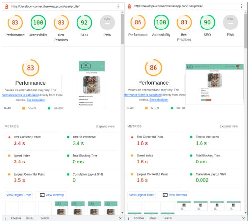 | Few warnings such as slow response time due to large images, images not properly sized or in next-gen formats, unused CSS present. Does not use HTTPS. |
| Edit profile |  | Few warnings such as slow response time due to large images, images not properly sized or in next-gen formats, unused CSS present. Does not use HTTPS. |
| Profile pictures page | 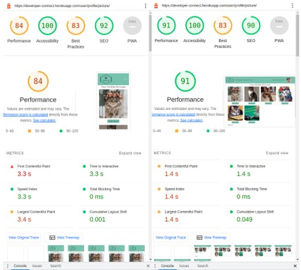 | Few warnings such as slow response time due to large images, images not properly sized or in next-gen formats, unused CSS present. Does not use HTTPS. |
| Other user profile |  | Few warnings such as slow response time due to large images, images not properly sized or in next-gen formats, unused CSS present. Does not use HTTPS. |
| Project Overview | 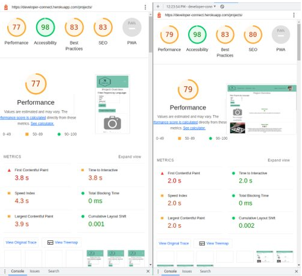 |Few warnings such as slow response time due to large images, images not properly sized or in next-gen formats, unused CSS present. Does not use HTTPS. |
| Individual project |  | Few warnings such as slow response time due to large images, images not properly sized or in next-gen formats, unused CSS present. Does not use HTTPS. |
| New project |  | Few warnings such as slow response time due to large images, images not properly sized or in next-gen formats, unused CSS present. Does not use HTTPS. |
| Edit project | 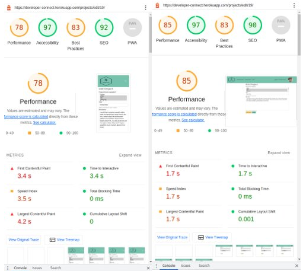 | Few warnings such as slow response time due to large images, images not properly sized or in next-gen formats, unused CSS present. Does not use HTTPS. |
| Project pictures |  | Few warnings such as slow response time due to large images, images not properly sized or in next-gen formats, unused CSS present. Does not use HTTPS. |
| Messages |  | Few warnings such as slow response time due to large images, images not properly sized or in next-gen formats, unused CSS present. Does not use HTTPS. |
| New message |  | Few warnings such as slow response time due to large images, images not properly sized or in next-gen formats, unused CSS present. Does not use HTTPS. |
| Edit message |  | Few warnings such as slow response time due to large images, images not properly sized or in next-gen formats, unused CSS present. Does not use HTTPS. |

## Defensive Programming

⚠️⚠️⚠️⚠️⚠️ START OF NOTES (to be deleted) ⚠️⚠️⚠️⚠️⚠️

Defensive programming (defensive design) is extremely important!

When building projects that accept user inputs or forms, you should always test the level of security for each.
Examples of this could include (not limited to):

Forms:
- Users cannot submit an empty form
- Users must enter valid email addresses

PP3 (Python-only):
- Users must enter a valid letter/word/string when prompted
- Users must choose from a specific list only

Flask/Django:
- Users cannot brute-force a URL to navigate to a restricted page
- Users cannot perform CRUD functionality while logged-out
- User-A should not be able to manipulate data belonging to User-B, or vice versa
- Non-Authenticated users should not be able to access pages that require authentication
- Standard users should not be able to access pages intended for superusers

You'll want to test all functionality on your application, whether it's a standard form,
or uses CRUD functionality for data manipulation on a database.
Make sure to include the `required` attribute on any form-fields that should be mandatory.
Try to access various pages on your site as different user types (User-A, User-B, guest user, admin, superuser).

You should include any manual tests performed, and the expected results/outcome.

🛑🛑🛑🛑🛑 END OF NOTES (to be deleted) 🛑🛑🛑🛑🛑

Defensive programming was manually tested with the below user acceptance testing:

| Page | User Action | Expected Result | Pass/Fail | Comments |
| --- | --- | --- | --- | --- |
| Home Page | | | | |
| | Click on Logo | Redirection to Home page | Pass | |
| | Click on Home link in navbar | Redirection to Home page | Pass | |
| Gallery Page | | | | |
| | Click on Gallery link in navbar | Redirection to Gallery page | Pass | |
| | Load gallery images | All images load as expected | Pass | |
| Contact Page | | | | |
| | Click on Contact link in navbar | Redirection to Contact page | Pass | |
| | Enter first/last name | Field will accept freeform text | Pass | |
| | Enter valid email address | Field will only accept email address format | Pass | |
| | Enter message in textarea | Field will accept freeform text | Pass | |
| | Click the Submit button | Redirects user to form-dump | Pass | User must click 'Back' button to return |
| Sign Up | | | | |
| | Click on Sign Up button | Redirection to Sign Up page | Pass | |
| | Enter valid email address | Field will only accept email address format | Pass | |
| | Enter valid password (twice) | Field will only accept password format | Pass | |
| | Click on Sign Up button | Asks user to confirm email page | Pass | Email sent to user |
| | Confirm email | Redirects user to blank Sign In page | Pass | |
| Log In | | | | |
| | Click on the Login link | Redirection to Login page | Pass | |
| | Enter valid email address | Field will only accept email address format | Pass | |
| | Enter valid password | Field will only accept password format | Pass | |
| | Click Login button | Redirects user to home page | Pass | |
| Log Out | | | | |
| | Click Logout button | Redirects user to logout page | Pass | Confirms logout first |
| | Click Confirm Logout button | Redirects user to home page | Pass | |
| Profile | | | | |
| | Click on Profile button | User will be redirected to the Profile page | Pass | |
| | Click on the Edit button | User will be redirected to the edit profile page | Pass | |
| | Click on the My Orders link | User will be redirected to the My Orders page | Pass | |
| | Brute forcing the URL to get to another user's profile | User should be given an error | Pass | Redirects user back to own profile |

⚠️⚠️⚠️⚠️⚠️ START OF NOTES (to be deleted) ⚠️⚠️⚠️⚠️⚠️

Repeat for all other tests, as applicable to your own site.
The aforementioned tests are just an example of a few different project scenarios.

🛑🛑🛑🛑🛑 END OF NOTES (to be deleted) 🛑🛑🛑🛑🛑

## User Story Testing

Each of the User Stories mentioned in the [README.md](README.md) file were tested to ensure correct functionality and complete implementation of the User Story.

[User Story testing](https://docs.google.com/spreadsheets/d/1gGXyeVyqV9Qn-6OWgzcTl8FbropnZFla_UFe-G648LY/edit#gid=0) is linked here in an external Google sheet.

For each User Story, the Epic to which the User Story belongs is listed along with the user story number, the title of the User Story, it's MoSCow prioritation and each of the acceptance criteria for the User Story. There is then a column each for whether the feature was implemented and (if implemented) whether it is working correctly. There is also a screenshot where relevant to demonstrate the implementation of the User Sotry.


## Automated Testing

I have conducted a series of automated tests on my application.

I fully acknowledge and understand that, in a real-world scenario, an extensive set of additional tests would be more comprehensive.

### Python (Unit Testing)
I have used Django's built-in unit testing framework to test the application functionality.

In order to run the tests, I ran the following command in the terminal each time:

`python3 manage.py test name-of-app `


The unittests run for the project are listed below, seperated by Django app and file (models or views)

For **app_user** app:
**views.py**

| Function Tested  | Function Type  |  Testing for.. | Assert Statement   |  Pass |
|---|---|---|---|---|
| User Registration  | get   | Starting number of users is 0  | self.assertEqual(User.objects.count(), 0)  | pass  |
|   |    | registration page loads successfully  | self.assertEqual(response.status_code, 200)  | pass  |
|   |    | correct template is used for registration  | self.assertTemplateUsed(response, "app_user/register.html")  | pass  |
|   | post   | redirection following registration  | self.assertEqual(response.status_code, 302)  | pass  |
|   |    | user redirected correctly to user profile after signing up  | self.assertRedirects(response, "/user/profile/")  | pass  |
|   |    | user was added to the database  | self.assertEqual(User.objects.count(), 1)  | pass  |
|   |    | user logged in and authenticated after signup  | self.assertTrue(newly_created_user.is_authenticated)  | pass  |
|   |    | signup date is correctly added  | self.assertTrue(newly_created_user.date_joined, datetime.now())  | pass  |
|   |    | no new user was created if incorrect credentials supplied  | self.assertEqual(User.objects.count(), 0)  | pass  |
|   |    | browser rerenders the form for submission again  | self.assertEqual(response.status_code, 200)  | pass  |
|   |    | browser rerenders the form for submission again  | self.assertTemplateUsed(response, "app_user/register.html")  | pass  |
| User login  | get  |  login form successfully loaded  |  self.assertEqual(response.status_code, 200) | pass  |
|   |   |  login template used  | self.assertTemplateUsed(response, "account/login.html")  | pass  |
|   |   | user is authenticated following login  | self.assertTrue(test_user.is_authenticated)  | pass  |

**models.py**
| Model Tested  | Function Type  |  Testing for.. | Assert Statement   |  Pass |
|---|---|---|---|---|
| user model  |    | `__str__` method  | self.assertEqual(str(self.user), "<user: testuser>")  | pass  |
|   |    | `to_json` method  | self.assertEqual(self.user.to_json(), expected_output)  | pass  |
|   |    | user profile picture uploaded  | self.assertEqual(profile_picture.profile_picture, cloudinary_field_mock.return_value)  | pass  |
| project model  |    | `__str__` method project 1 | self.assertEqual(str(self.project1), "<Project name: Test Project 1>")  | pass  |
|   |    | `__str__` method project 2  | self.assertEqual(str(self.project2), "<Project name: Test Project 2>")  | pass  |
|   |    | project 1 user count = 1  | self.assertEqual(self.project1.user.count(), 1)  | pass  |
|   |    | project 1 p language count = 1  | self.assertEqual(self.project1.p_language.count(), 1)  | pass  |
|   |    | project 2 user count = 2  | self.assertEqual(self.project2.user.count(), 2)  | pass  |
|   |    | project 2 p language count = 2  | self.assertEqual(self.project2.p_language.count(), 2)  | pass  |
|   |    | project picture upload  | self.assertEqual(project_picture.project_picture, cloudinary_field_mock.return_value)  | pass  |


For **app_home** app:
**views.py**
Home and about views
| Function Tested  | Function Type  | Status | Testing for.. | Assert Statement   |  Pass |
|---|---|---|---|---|---|
| Home view  | get  | not logged in  | correct template used| self.assertTemplateUsed(template)  | pass  |
|   |   |   | status code 200 (success) |  self.assertEqual(response.status_code, 200)  | pass  |
|   |   |   | Response contains... |  self.assertContains(response, "Please log in to continue")  | pass  |
|   |   | logged in user  | correct template used |  self.assertTemplateUsed(template)  | pass  |
|   |   |   | status code 200 (success) |  self.assertEqual(response.status_code, 200)  | pass  |
|   |   |   | Response doesn't contain... |  self.assertNotContains(response, "Please log in to continue")  | pass  |
| About view  | get  | any  | correct template used |  self.assertTemplateUsed(template)  | pass  |
|   |   |   | status code 200 (success) |  self.assertEqual(response.status_code, 200)  | pass  |


View other users
| Function Tested  | Function Type  | Status | Testing for.. | Assert Statement   |  Pass |
|---|---|---|---|---|---|
| Developer Overview page  | get  | not logged in  | correct template used |  self.assertTemplateUsed(template)  | pass  |
|   |   |   | status code 200 (success) |  self.assertEqual(response.status_code, 200)  | pass  |
|   |   |   | Response contains... |  self.assertContains(response, "Please log in or register to see the Developer Overview")  | pass  |
|   |   | logged in user  | correct template used |  self.assertTemplateUsed(template)  | pass  |
|   |   |   | status code 200 (success) |  self.assertEqual(response.status_code, 200)  | pass  |
|   |   |   | Response doesn't contain... |  self.assertNotContains(response, "Please log in or register to see the Developer Overview")  | pass  |
| Profile detail view (successful)  | get  | not logged in  | status code 302 (redirect) |  self.assertEqual(response.status_code, 302)  | pass  |
|   |   |   |  redirection url |  self.assertRedirects(response, f"/user/login/?next={url}")  | pass  |
|   |   | logged in user  | status code 200 (success) |  self.assertEqual(response.status_code, 200)  | pass  |
|   |   |   | correct template used |  self.assertTemplateUsed(response, template)  | pass  |
|   |   |   | check response contains user1 |  self.assertEqual(response.context["user"], self.user1)  | pass  |
|   |   |   | check response contains user2 |  self.assertEqual(response.context["user_for_profile"], self.user2)  | pass  |
| Profile detail view (profile does not exist)  | get  | logged in  | status code 404 (not found) |  self.assertEqual(response.status_code, 404)  | pass  |

View projects
| Function Tested  | Function Type  | Status | Testing for.. | Assert Statement   |  Pass |
|---|---|---|---|---|---|
| View project overview  | get  | not logged in  | correct template used |  self.assertTemplateUsed(template)  |   |
|   |   |   | status code 200 (success) |  self.assertEqual(response.status_code, 200)  |   |
|   |   |   | Response contains... |  self.assertContains(response, "Please log in or register to see projects")  | pass  |
|   |   | logged in user  | status code 200 (success) |  self.assertEqual(response.status_code, 200)  | pass  |
|   |   |   | correct template used |  self.assertTemplateUsed(response, template)  | pass  |
|   |   |   | Response contains... |  self.assertContains(response, self.project1.title)  | pass  |
|   |   |   | Response contains... |  self.assertContains(response, self.project2.title)  | pass  |
| View project overview (no projects)  | get  |   | status code 200 (success) |  self.assertEqual(response.status_code, 200)  | pass  |
|   |   |   | correct template used |  self.assertTemplateUsed(response, template)  | pass  |
|   |   |   | Response doesn't contain... |  self.assertNotContains(response, self.project1.title)  | pass  |
|   |   |   | Response doesn't contain... |  self.assertNotContains(response, self.project2.title)  | pass  |
| View project details  | get  | not logged in  | status code 302 (redirect) |  self.assertEqual(response.status_code, 302)  | pass  |
|   |   |   | redirection url |  self.assertRedirects(response, f"/user/login/?next={url}")  | pass  |
|   |   | user logged in  | status code 200 (success) |  self.assertEqual(response.status_code, 200)  | pass  |
|   |   |   | correct template used |  self.assertTemplateUsed(response, template)  | pass  |
|   |   |   | Response contains... |  self.assertContains(response, self.project1.title)  | pass  |
| View project details (project does not exist)  | get  | logged in user  | status code 404 (not found) |  self.assertEqual(response.status_code, 404)  | pass  |

Create a new project
| Function Tested  | Function Type  | Status | Testing for.. | Assert Statement   |  Pass |
|---|---|---|---|---|---|
| Create project  | get (get form)  | not logged in  | status code 302 (redirect) |  self.assertEqual(response.status_code, 302)  | pass  |
|   |   |   | redirection url |  self.assertRedirects(response, f"/user/login/?next={url}")  | pass  |
|   |   | logged in user  | status code 200 (success) |  self.assertEqual(response.status_code, 200)  | pass  |
|   |   |   | correct template used |  self.assertTemplateUsed(response, template)  | pass  |
| Create project  | post (valid)  | logged in user  | status code 302 (redirect) |  self.assertEqual(response.status_code, 302)  | pass  |
|   |   |   | project count increased by 1 |  self.assertEqual(Project.objects.count(), project_count + 1)  | pass  |
|   |   |   | new project title = "ProjectTitle3" |  self.assertEqual(Project.objects.last().title, "ProjectTitle3")  | pass  |
|   |   |   | new project contains lang 1 and 2|  self.assertCountEqual(Project.objects.last().p_language.all(),[self.language1, self.language2],)  | pass  |
|   |   |   | new project belongs to user 1|  self.assertEqual(Project.objects.last().user.last(), self.user1)  | pass  |
| Create project  | post (invalid)  | logged in user  | status code 302 (redirect) |  self.assertEqual(response.status_code, 302)  | pass  |
|   |   |   | project count has not increased |  self.assertEqual(Project.objects.count(), project_count)  | pass  |


Edit a project
| Function Tested  | Function Type  | Status | Testing for.. | Assert Statement   |  Pass |
|---|---|---|---|---|---|
| Edit project  | get (form) | not logged in  | status code 302 (redirect)  | self.assertEqual(response.status_code, 302)  | pass  |
|   |   |   | redirection url  | self.assertRedirects(response, f"/user/login/?next={url}")  | pass  |
|   |   | logged in (project owner)  | status code 200 (success)  | self.assertEqual(response.status_code, 200)  | pass  |
|   |   |   | correct template used  | self.assertTemplateUsed(response, template)  | pass  |
| Edit project  | post (valid)  | project owner  | status code 302 (redirect)  | self.assertEqual(response.status_code, 302)  | pass  |
|   |   |   | # projects has not changed  | self.assertEqual(Project.objects.count(), project_count)  | pass  |
|   |   |   | title is updated  | self.assertEqual(Project.objects.get(pk=self.project1.pk).title, "CHANGED TITLE!")  | pass  |
|   |   |   | description is updated  | self.assertEqual(Project.objects.get(pk=self.project1.pk).description,"CHANGED Project description3",)  | pass  |
|   |   |   | correct languages are saved  | self.assertCountEqual(Project.objects.get(pk=self.project1.pk).p_language.all(),[self.language1, self.language2],)  | pass  |
| Edit project  | post (invalid)  | project owner  | status code 200 (success)  | self.assertEqual(response.status_code, 200)  | pass  |
|   |   |   | correct template used  | self.assertTemplateUsed(response, template)  | pass  |
|   |   |   | # projects has not changed  | self.assertEqual(Project.objects.count(), project_count)  | pass  |
|   |   |   | title is unchanged  | self.assertEqual(Project.objects.get(pk=self.project2.pk).title, self.project2.title)  | pass  |
|   |   |   | description is unchanged  | self.assertEqual(Project.objects.get(pk=self.project2.pk).description,self.project2.description)  | pass  |
|   |   |   |  p langs are unchanged  | self.assertCountEqual(Project.objects.get(pk=self.project2.pk).p_language.all(),self.project2.p_language.all())  | pass  |

Delete a project
| Function Tested  | Function Type  | Status | Testing for.. | Assert Statement   |  Pass |
|---|---|---|---|---|---|
| Delete project  | get | not logged in   | status code 302 (redirect)  | self.assertEqual(response.status_code, 302)  | pass  |
|   |   |   | redirection url  | self.assertRedirects(response, f"/user/login/?next={url}")  | pass  |
|   |   | project owner  |  # projects has decreased by 1  | self.assertEqual(Project.objects.count(), project_count - 1)  | pass  |
|   |   |   | project 1 is no longer first in project list  | self.assertNotEqual(Project.objects.first(), self.project1)  | pass  |
|   |   |   | project 2 is now first in project list  | self.assertEqual(Project.objects.first(), self.project2)  | pass  |


Add project picture

| Function Tested | Function Type | Status | Testing for.. | Assert Statement | Pass |
|---|---|---|---|---|---|
| Add project picture  | get  | not logged in  | status code 302 (redirect)  | self.assertEqual(response.status_code, 302)  | pass  |
|   |   |   | redirection url  |  self.assertRedirects(response, f"/user/login/?next={url}") | pass  |
|   |   | project owner logged in  |   | self.assertEqual(response.status_code, 200)  | pass  |
|   |   | status code 200 (success)  | correct template used  | self.assertTemplateUsed(response, template)  | pass  |
|   | post (with mock)  | project owner  | status code 302 (redirect)  | self.assertEqual(response.status_code, 302)  | pass  |
|   |   |   | # pics increased by 1  | self.assertEqual(len(self.project1.project_pic.all()), no_pics + 1)  | pass  |

#### Unit Test Issues
The following unittest was implemented for testing the deletion of a project picture.


```python
    @mock.patch("cloudinary.uploader.upload")
    def test_delete_project_picture_post(self, mock_uploader_upload):
        # logging in project owner
        self.client.force_login(self.user1)

        # setup - add a mocked picture
        template = "app_home/project_picture.html"
        url = reverse(
            "app_home:add-project-pic", kwargs={"pk": self.project1.pk}
        )

        # number of pics before upload
        no_pics = len(self.project1.project_pic.all())
        # mocking
        mock_uploader_upload = "picture.jpg"
        # define URL & image
        mocked_picture = SimpleUploadedFile(
            "picture.jpg", b"file_content", content_type="image/jpeg"
        )
        # add the mocked picture to the project
        response = self.client.post(url, {"project_picture": mocked_picture})

        # check that mocked picture is set
        self.assertEqual(len(self.project1.project_pic.all()), no_pics + 1)
        picture_object = self.project1.project_pic.get(project=self.project1.pk)

        # now delete the mocked picture
        template = "app_home/project_picture.html"
        url = reverse(
            "app_home:delete-project-pic", kwargs={"pk": picture_object.pk}
        )
        response = self.client.get(url)
        # test that the picture is deleted
        self.assertEqual(len(self.project1.project_pic.all()), no_pics)

```

Throughout development, this test was working, however, at some later point it was returning the error `IndexError: list index out of range` in reference to the `picture_object = self.project1.project_pic.get(project=self.project1.pk)` variable assignment.


It is unclear why this error should be thrown, and when investigating using a breakpoint, the `self.project1.project_pic.get(project=self.project1.pk)` variable is correctly accessible.


 Delete project picture

| Function Tested | Function Type | Status | Testing for.. | Assert Statement  |
|---|---|---|---|---|
| Delete project pic  | get  | project owner  | ensure that mocked picture has been added first  | self.assertEqual(len(self.project1.project_pic.all()), no_pics + 1)    |
|   |   |   | mocked picture has been deleted  | self.assertEqual(len(self.project1.project_pic.all()), no_pics)    |

### GitHub CI
For this project, a [Continuous Integration (CI) workflow](https://github.com/dragon-fire-fly/developer_matcher/actions) was implemented using GitHub Actions. This means that the requested tests may be run on the project each time a push or a pull request is performed. The specifics of the CI workflow can be found in the [ci.yml file in the project](https://github.com/dragon-fire-fly/developer_matcher/blob/main/.github/workflows/ci.yml). The CI performs 15 steps including importing requirements, making relevant database migrations, performing unittests and performing a pep8 compliance check using Black (with a custom line-length of 79 characters).

Once set up, a CI worflow is extremely helpful for monitoring the quality of the code and ensuring that all unittests continue to run successfully when code is altered or added to.

An example of a successful ci run is shown below:  


Unfortunately, the CI appears unable to access the SECRET_KEY value stored in Github and therefore requires a hard coded SECRET_KEY in the settings.py file. This was accomplished throughout development with the following code:  
```python
if os.getenv("GITHUB_WORKFLOW"):
    SECRET_KEY = (
        "MySuperInsecureSecretKeyOnlyForGithubActionsThatIsLongerThan50Chars"
    )
else:
    SECRET_KEY = os.environ.get("SECRET_KEY", "")
```

This provided the real secret key value for the local and deployed version, but supplied a fake secret_key value to GitHub Actions. However, for official release, this was removed from the settings.py file. The database migrations therefore fail in the ci and the unittests and pep8 check cannot be run. To reinstate the GitHub CI, a secret key must be provided.


## Bugs
### GitHub **Issues**
Bugs were tracked from the start of the project using **GitHub Issues**
A custom [**Bug Report Template**](https://github.com/dragon-fire-fly/developer_matcher/issues/new?assignees=dragon-fire-fly&labels=bug&template=bug_report.md&title=%5BBUG%5D) was created for the purpose of concisely and accurately tracking bugs at the time they were discovered.

**Fixed Bugs**
Closed bug issues may be found on [GitHub Issues](https://github.com/dragon-fire-fly/developer_matcher/issues?q=is%3Aissue+is%3Aclosed+BUG) and are also listed in the table below.

| Issue no.  | Bug name  | Milestone  | Fixed |
|---|---|---|---|
| 13  | [SetUp - SystemCheckError](https://github.com/dragon-fire-fly/developer_matcher/issues/13)  | Account Management  | Yes  |
| 14  | [InconsistentMigrationHistory Error](https://github.com/dragon-fire-fly/developer_matcher/issues/14)  | Account Management  | Yes  |
| 15  | [IntegrityError](https://github.com/dragon-fire-fly/developer_matcher/issues/15)  | Account Management  | Yes  |
| 16  | [Sign up form not valid](https://github.com/dragon-fire-fly/developer_matcher/issues/16)  | Account Management  | Yes  |
| 17  | [Checkboxes not displaying correctly](https://github.com/dragon-fire-fly/developer_matcher/issues/17)  | Account Management  | Yes  |
| 37  | [Projects cannot be viewed if the project owner no longer exists](https://github.com/dragon-fire-fly/developer_matcher/issues/37)  | Project Interation  | Yes  |
| 38  | [The first photo is always deleted when a user tries to delete a photo](https://github.com/dragon-fire-fly/developer_matcher/issues/38)  | User Interation  | Yes  |
| 45  | [Checkboxes are not rendered pre-checked](https://github.com/dragon-fire-fly/developer_matcher/issues/45)  | User Interation  | Yes  |
| 63  | [Registration page not loading](https://github.com/dragon-fire-fly/developer_matcher/issues/63)  | Account Management  | Yes  |
| 64  | [Delete user profile not working](https://github.com/dragon-fire-fly/developer_matcher/issues/64)  | Account Management  | Yes  |
| 71  | [Wrong user being shown when editing message](https://github.com/dragon-fire-fly/developer_matcher/issues/71)  | User Interation  | Yes  |
| 72  | ['edited' status being added to new messages](https://github.com/dragon-fire-fly/developer_matcher/issues/72)  | User Interation  | Yes  |
| 74  | [Developer overview page pagination problem](https://github.com/dragon-fire-fly/developer_matcher/issues/74)  | User Interation  | Yes  |


**Open Issues**

Any remaining open issues can be tracked [here](https://github.com/dragon-fire-fly/developer_matcher/issues).

## Unfixed Bugs

⚠️⚠️⚠️⚠️⚠️ START OF NOTES (to be deleted) ⚠️⚠️⚠️⚠️⚠️

You will need to mention unfixed bugs and why they were not fixed.
This section should include shortcomings of the frameworks or technologies used.
Although time can be a big variable to consider, paucity of time and difficulty understanding
implementation is not a valid reason to leave bugs unfixed.

If you've identified any unfixed bugs, no matter how small, be sure to list them here.
It's better to be honest and list them, because if it's not documented and an assessor finds the issue,
they need to know whether or not you're aware of them as well, and why you've not corrected/fixed them.

Some examples:

🛑🛑🛑🛑🛑 END OF NOTES (to be deleted) 🛑🛑🛑🛑🛑

- On devices smaller than 375px, the page starts to have `overflow-x` scrolling.

    

    - Attempted fix: I tried to add additional media queries to handle this, but things started becoming too small to read.

- For PP3, when using a helper `clear()` function, any text above the height of the terminal does not clear, and remains when you scroll up.

    

    - Attempted fix: I tried to adjust the terminal size, but it only resizes the actual terminal, not the allowable area for text.

- When validating HTML with a semantic `section` element, the validator warns about lacking a header `h2-h6`. This is acceptable.

    

    - Attempted fix: this is a known warning and acceptable, and my section doesn't require a header since it's dynamically added via JS.

⚠️⚠️⚠️⚠️⚠️ START OF NOTES (to be deleted) ⚠️⚠️⚠️⚠️⚠️

If you legitimately cannot find any unfixed bugs or warnings, then use the following sentence:

🛑🛑🛑🛑🛑 END OF NOTES (to be deleted) 🛑🛑🛑🛑🛑

There are no remaining bugs that I am aware of.
